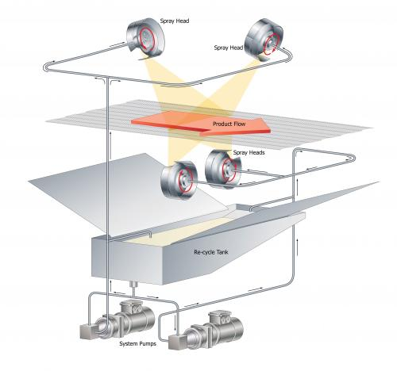
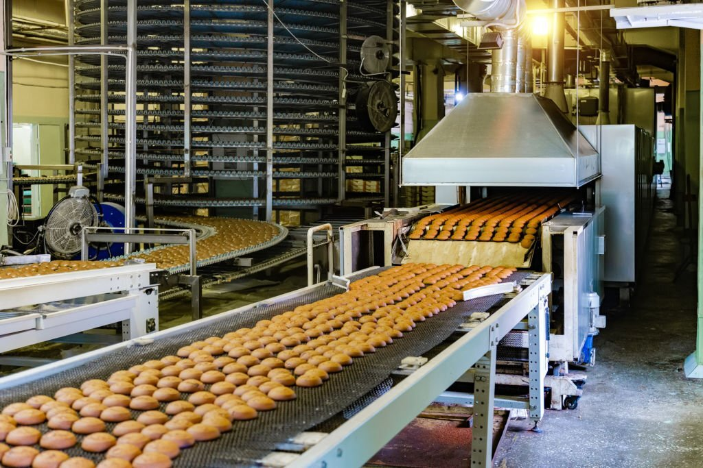

## Egg Glazing

Egg Glazing, sometimes referred to as Egg Washing, is the singular most popular spraying application in the bakery industry. It transforms a pastry product into the golden honey-colored product that we find mighty difficult to resist. These could include but are not limited to:

- Bread Rolls
- Brioches
- Cornish Pasties
- Croissants
- Flat Top Pies
- Sausage Rolls

The quality of glaze can make a profound difference to the visual acceptance of the product, which is why many of the larger retailers worldwide specify the glazing requirements so exactly. The glaze must be applied in a homogenous, streak-free process; where over-glazing, spots, drips, or void areas are simply not acceptable. Glaze application technologies such as brushing or spray nozzles simply fail to meet these requirements and are discounted as serious contenders in most processing lines.

  <iframe src="https://www.youtube.com/embed/pvMzPnTtPvw" style="position: absolute; top: 0; left: 0; width: 100%; height: 100%; border: 0; border-radius: 8px;" allowfullscreen="" frameborder="0"></iframe>

With Spinning Disc Spraying, the glaze is applied to either the 'top only' or 'top & sides' surfaces, depending on the needs of the product. The combination of the number of disc pairs, their geometric position, and the system's various speed settings give the desired precision spray coverage. Metal Workers System's DiscMaster™ and DiscMatic™ series of machines are designed to provide high-performance egg glazing capabilities.

The egg glaze itself can be real or synthetic and applied at either ambient or chilled temperatures. EU recommendation stresses the importance of maintaining real egg at a temperature of between 4 to 6 °C. Saturn provides the facility to temperature regulate the spray material during application. The advantage of our design is that the spray material is being continuously pumped around the machine and returned to the system reservoir, which brings the spray material into contact with the refrigerated surfaces of the machine, which maintains the temperature of the egg glaze more accurately.

Our clients tell us that our Technology allows them to:

- Meet the exacting requirements of retailers worldwide
- Deliver homogenous spray coverage with precision control
- Extend the useful operational life of the glaze by continuous recycling
- Save costs by applying an expensive glaze at the optimal coverage rate with minimal wastage
- Operate a virtual blockage-free production process with high yield rates
- Handle real eggs in a safe, controlled environment without clouds of atomized egg in the working area

  <iframe src="https://www.youtube.com/embed/hueXws6cXNE" style="position: absolute; top: 0; left: 0; width: 100%; height: 100%; border: 0; border-radius: 8px;" allowfullscreen="" frameborder="0"></iframe>

<!-- Oil Gazing -->

## Oil Spraying

Food Production requires the spraying of oil onto food surface for the following reasons:

### Barrier Coat

Oils such as Palm Oil are sprayed over the outside of the product. The coating reduces the uptake of moisture in the next manufacturing stage. Since viscosity is inversely proportional to temperature for all materials, the palm oil (which is a solid at room temperature) is heated to the point where the viscosity is optimum for precision spraying.

### Provide Lubrication

Oil acts as a lubricant between the layers of pastry in products like Filo Pastry, where dough oiling ensures an excellent product.

### Crisping Agent

Oil is sprayed onto the outside of the product to improve product texture in the next stage of the cooking process. For example, French Fries & Roast Potatoes.

### Barrier Coat Spraying

Dough Oiling is simply the process of providing a light film of oil to the outer surface of kneaded dough, including dough balls and pizza bases. One of the most popular oiling processes is the preparation of Filo {Phyllo, Fillo} pastry for pie lines. Oil can be applied to either a single side or both sides of the continuous pastry line, providing lubrication as it is folded and layered.

The process requires that the applicator should:

- Apply oil homogeneously across the Filo pastry
- Cover both sides of the pastry (if required)
- Precision regulation of the oil coverage
- Accommodate relatively high-speed line application

Saturn's DiscMaster™ and DiscMatic™ Series of Spraying Systems provide the optimum oiling application systems by utilizing the 2D Top & Bottom system configuration.

These systems provide:

- Precision control for optimum system yield
- Consistent and even homogenous spray coverage 'Top & Bottom'
- Upgraded pump selection for high-speed application
- Auto refill reservoir option for long endurance application which reduces operator interaction

<!-- Bread Preservatives -->

## Bread Preservatives

For leavened bread products, particularly in warmer environments, a mixture of Potassium Sorbate and other mold inhibitors is applied to the external surfaces of the bread to increase the shelf life. By inhibiting the growth of mold, the shelf life can be significantly extended without compromising either the taste or the cosmetic appearance of the bread. The Potassium Sorbate needs to be applied with evenness and precision to ensure that the loaf is completely coated.

Preservatives are precision sprayed onto the bread as one of the last manufacturing processes the bread is subjected to after it exits the oven. It is important to ensure that adjacent products do not mask or inhibit the application of the Potassium Sorbate spray. Divergent conveyor belts or spreaders are used to increase the gap between the loaves until full spray coverage can be completed. A converging conveyor is often used to return the loaves to their previous belt configuration.

Saturn's DiscMaster™ and DiscMatic™ Spinning Disc Spraying Systems both equally lend themselves to this application. The choice of systems depends on the conveyor belt size and scale of the operation. High-volume bread production invariably requires the belt widths available only with the DiscMatic™ system.

The key success drivers in this process are:

- Accuracy in the spraying of bread loaves
- Accurate control of the deposition rate with equal three-dimensional spray strength
- Conveyor spreaders and convergers to remove the inter-product masking effects
- Effective operation in a high-volume, high-yield environment

