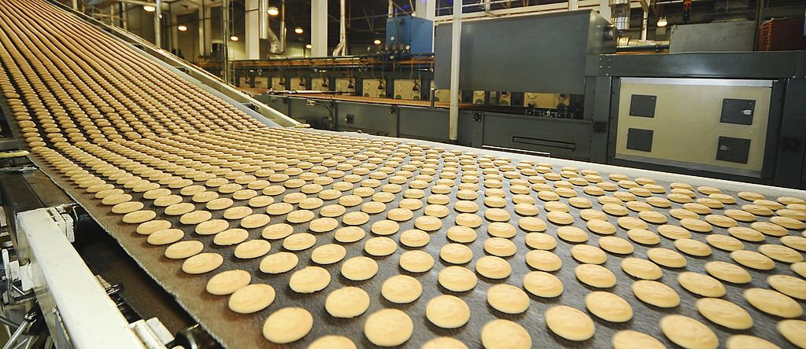

## Oil & Salt Coating

Oil & Salt coating of Biscuits and Snacks is easily accomplished with Saturn's DiscMatic™ Slurry System. As with the application of flavours, spices, and seasoning, a base layer of oil provides the medium for the additive to form a simple slurry mixture. This is a particularly efficient and effective way of applying your coating as it reduces the number and expense of the processing equipment and improves the adhesion and distribution of the particulate over the food product.

The technology available to apply this slurry spray is limited almost entirely to spinning disc spraying with its virtual blockage free performance since nozzle appliances spectacularly fail in this area.

Saturn Slurry machines use hygienic stainless steel pumps, absent from potential blocking points and no mating surfaces to crush and damage the product. Some types of pump throw the particles outwards causing them to stick to the chamber walls, which can create blockages and crush the particles, which, in the case of herbs etc., can change the flavour of the particle.

Saturn's DiscMatic™ Slurry Variant System demonstrates the key features required to satisfactorily handle and apply particulates in solution.

#### APPLICATIONS

- Bakery Products

<!-- Milk Glazing -->

## Milk Glazing

Milk Glazing is most often used to put a 'shine' on sweet biscuits, and the quality of glaze can make a difference to the visual appeal of the product. The glaze must be applied in a homogenous, streak-free process. Over-glazing, spots, drips, or void areas are simply not acceptable.

With Spinning Disc Spraying, the glaze is applied to either the 'top only' or 'top & sides' surfaces, depending on the size, shape, and needs of the product. The combination of the number of disc pairs, their geometric position, and the system's various speed settings give the desired precision spray coverage. Metal Workers System's DiscMaster™ and DiscMatic™ Series of machines are designed to provide high-performance glazing capabilities.

Our clients report that the benefits of our technology allow them to:

- Deliver homogenous spray coverage with precision control
- Extend the useful operational life of the glaze by continuous recycling
- Save costs by applying an expensive glaze at the optimal coverage rate with minimal wastage
- Achieve high yield rates with our virtual blockage-free production process.

#### APPLICATIONS

- Sweet Biscuits

## Biscuit Flavouring

Flavourings are commonly mixed with a carrier oil to improve handling and application during the manufacturing process. Flavours are not restricted to simple liquid additives but can also include powders, providing they dissolve completely.

### Spices Flavours

The key requirements associated with successful application of flavourings are:

- Blockage Free Application Process
- Controlled Deposition Rate
- Consistent Batch to Batch Performance
- Quick Changeover of Flavours
- High Yield Rate

Applying flavour requires the control of the deposition rate. The process should also be replicable between batches to ensure product consistency. However, balance and finesse are also important qualities to discuss, since some flavours impart a stronger impression than others. Nozzles and spray guns simply block and production downtime increases exponentially.

Metal Workers Systems' range of spinning disc machines is ideal for the process of applying flavour. The DiscMaster™ and DiscMatic™ machines are virtually blockage free and are able to apply just the right amount of flavour in a consistent and replicable way time after time.

## Nut & Sugar Sprinkling

Granular products such as sugars, nuts, dried herbs, breadcrumbs, and various seeds, such as poppy, sesame, and cracked wheat, can be sprinkled with even precision onto the top of produce using Saturn's Sprinkler. The sprinkler head is mounted over its own integral conveyor.

The sprinkler uses an interchangeable, grooved roller which is driven by an inverter controlled electric motor. The roller is mounted on the bottom of a hopper, into which the granular material to be sprinkled is placed. As the roller rotates, granular products in the hopper are gravity-fed to engage with the grooved roller. The grooves pick up granules and rotate through 180 degrees. The granular products are now free to drop by gravity onto the products directly underneath the roller.

The application rate is regulated by adjusting the speed of rotation of the roller, using the digital potentiometer in the control cabinet. The grooves in the roller are machined to accept the granular size of the product being sprinkled. Where different granular sizes of products are to be used, interchangeable application rollers may be required for each product.

