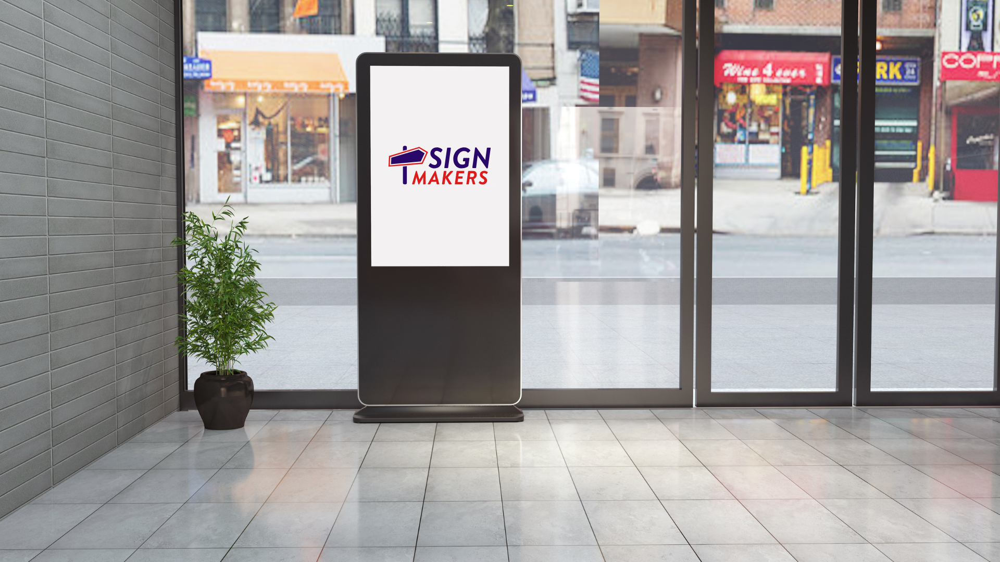
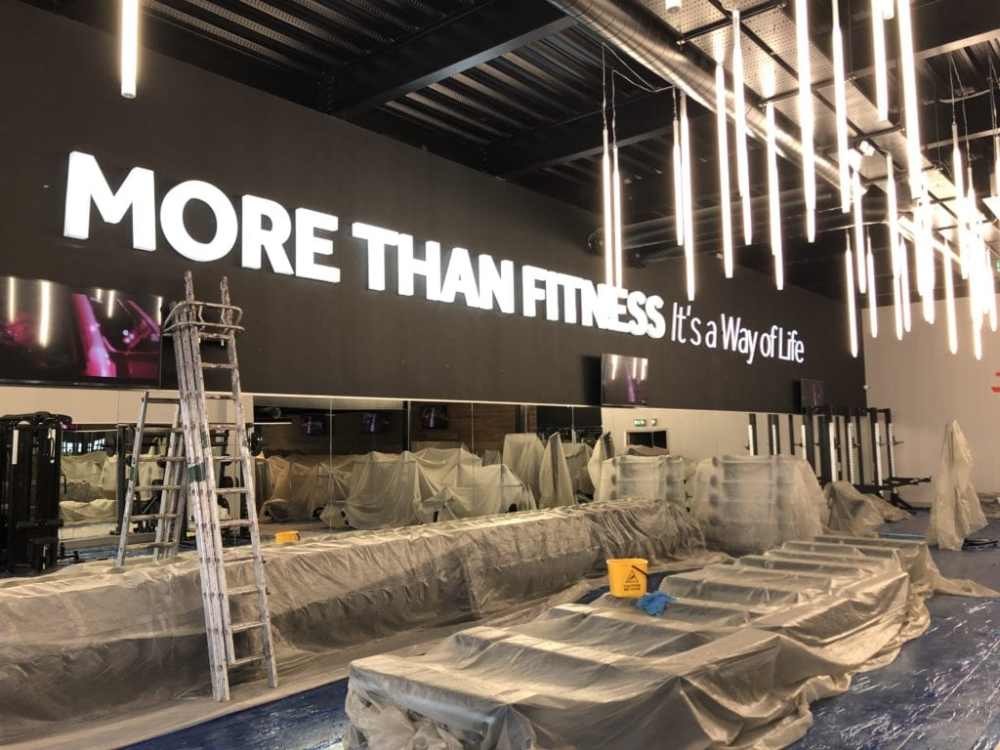
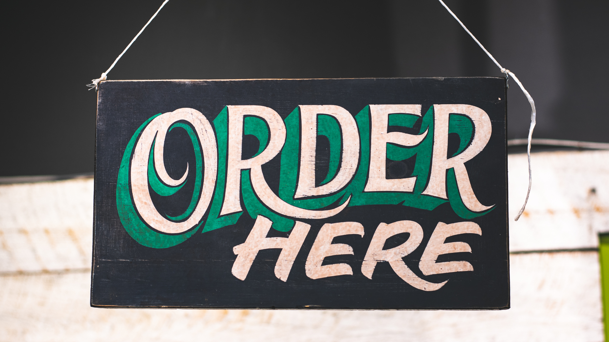
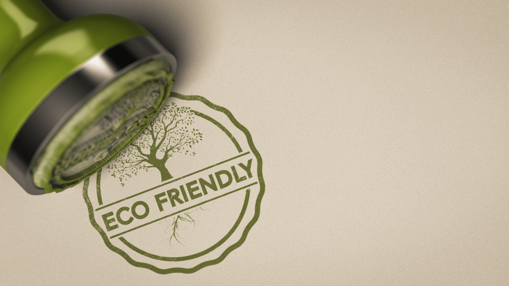
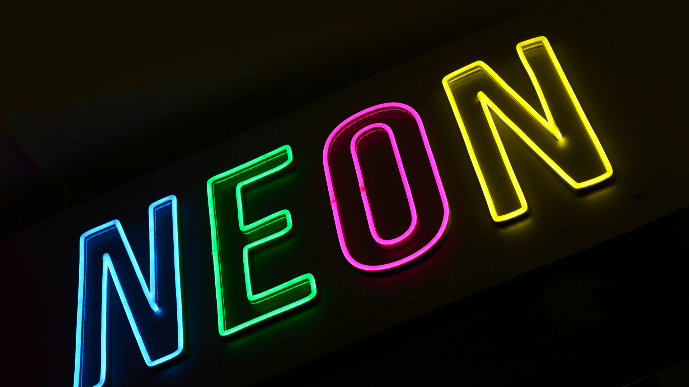
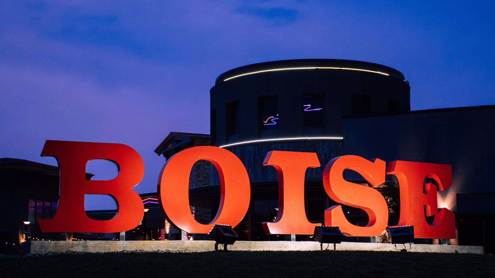

## 5 Signage Ideas To Boost Foot Traffic For Businesses In 2024

Imagine walking down a busy street, looking for a place to eat. You see a sign with bright colors and a fun picture of a pizza slice, and it catches your eye.

That’s the power of a good sign! Signs are like silent helpers for businesses. They grab the attention of people walking by and invite them to come inside.

Now, think about signs that are not just ordinary but super cool and different. In this blog post, we’re going to talk about seven innovative signage ideas that are sure to make people stop and look.

These aren’t just any signs; they’re creative, smart, and can even make you smile.

## Interactive Digital Signage

When you walk into a mall and see a big screen that lets you touch it to find stores, that’s called interactive digital signage. It’s like a giant tablet that helps you find your way or learn about cool deals in the mall. These signs are great because they talk back to you! You touch them, and they show you maps or games that make waiting fun.

For example, some signs have touchscreens where you can play games or draw pictures. Others have interactive maps that help you find the best route to the toy store. There are even signs with augmented reality displays—that means you might see a dinosaur pop out of the sign when you look at it through your phone!

These signs are super helpful because they give you information in a fun way. They can also change what they show based on what you do, which is pretty smart. So next time you see one, go ahead and give it a try!

## Dynamic LED Displays

Have you ever seen those big, bright screens in the city at night? They’re called dynamic LED displays, and they’re like huge TVs that show moving pictures and messages. They’re so bright and colorful that you can’t help but look at them!

These screens are great for businesses because they can change what they show. One minute, they might show a funny cartoon, and the next, they could tell you about a sale at a store. This is called versatility, which means they can do lots of different things.

The best part is that these screens are very easy to see, even from far away or when it’s super sunny outside. That’s called visibility. So, if a store has a dynamic LED display, more people can see their message, even if they’re just walking by.

Some cool examples are scrolling message boards that look like the words are moving across the screen, and animated advertisements that can tell a short story about a product. They’re not just signs; they’re like mini-movies that make you want to watch and see what happens next!

[To see how dynamic LED displays can elevate your brand presence, check out examples on Sign Makers website.](/portfolio/)

## Personalized Signage Solutions

Signs that know your name or what you like are called personalized signage. They’re special because they make you feel like the sign is talking just to you. Imagine walking into a store and seeing a sign that says, “Welcome back, friend! We have your favorite cookies on sale today!” That would make you feel pretty special, right?

Businesses can make signs like this by learning what their customers like. If they know you love comic books, they might show a sign with the latest superhero story just for you. Or if it’s your birthday, the sign could wish you a happy day with bright colors and fun pictures.

To create these signs, businesses can ask you what you like when you visit their website or store. They might use a computer program to remember what you buy or look at. Then, they use that information to change the signs to show things that you’re interested in.

So, personalized signs are like friends who know what you like and show you things that make you smile. They help businesses make shopping fun and personal for everyone!

## Eco-Friendly Signage Options

More and more, businesses are choosing signs that are good for the Earth. These are called eco-friendly signage options. They help keep our planet clean and green because they use materials that don’t hurt the environment.

Using eco-friendly signs is great because it shows that a business cares about nature. It can make people think better of the business, which is called enhancing the brand image. Plus, it’s a way to help our Earth stay healthy for a long time, which is known as sustainability.

Some materials that are used for these kinds of signs include recycled wood, which is wood that has been used before; bamboo, a super-fast growing plant that doesn’t need much water; and LED lighting, which uses less electricity and lasts a long time.

## Neon Signs

Neon signs can be a bright and fun part of eco-friendly signage! Neon signs are those glowing signs you see at night, often in big, bold letters. They’re made with a special kind of gas that lights up when electricity goes through it. This makes them shine in all sorts of cool colors.

Neon signs are great because they’re very easy to see, even in the dark, which makes them perfect for businesses that are open late. They have a unique style that can make a sign look like it’s from a retro movie or a futuristic city.

While traditional neon signs use a bit more energy, there are now eco-friendly neon signs that use LED technology. These are just as bright and colorful but use less power and last longer, which is better for our planet. So, adding a neon sign with LED lights can be a super choice for a business that wants to stand out and be kind to the Earth at the same time!

## Interactive Outdoor Signage

When you’re outside and see a screen that lets you touch it to play a game or learn something new, that’s interactive outdoor signage. These signs are like magic windows that can show you different things every time you look at them. They’re really good at getting people to come over and see what’s going on.

One of the best things about these signs is that they make people want to stop and use them. This is called engagement, and it’s like having a fun conversation without words. Because these signs are so interesting, they also make the place they’re in look more important and exciting. That’s the visibility part—they stand out and make you want to come closer.

Some cool examples of interactive outdoor signage include:
- **Outdoor touchscreens**: These can be like big iPads where you can look up information or play games.
- **Interactive displays**: Sometimes, these can show you how to do a dance or let you draw with lights.
- **Digital billboards**: These are like the dynamic LED displays we talked about, but they can also change based on what people standing nearby like or do.

So, interactive outdoor signage is a super way for businesses to get more people to visit and have a fun time even before they walk in the door!

---

Let’s light up your world with signs that shine! From interactive adventures outside your door to personal touches that say “we know you!”—we’ve got it all. Go green with eco-friendly options that dazzle and care for our planet. 🌱

Don’t wait for customers to find you—catch their eye and invite them in with a sign that says “something special’s happening here!” Tap into the future of signage and watch your foot traffic grow. 🚶‍♂️🚶‍♀️

Click that button and transform your space with signs that sparkle with personality and purpose. Let’s make your sign the sign that everyone talks about! ✨👇

<a href="/contact" style="display:inline-block;text-decoration:none;background-color:#29086A;color:white;padding:10px 20px;border-radius:5px;font-family:sans-serif;font-size:16px;text-align:center;">Contact Us</a>
