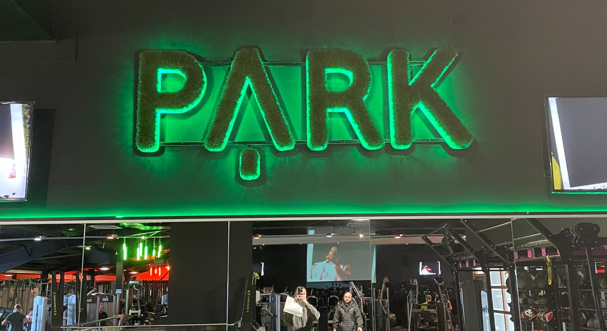
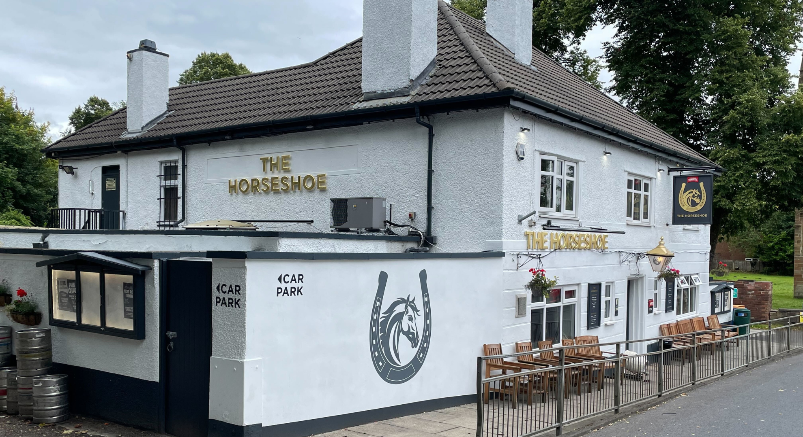
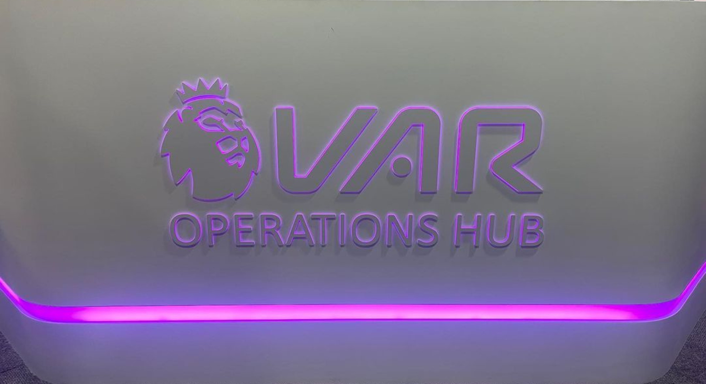
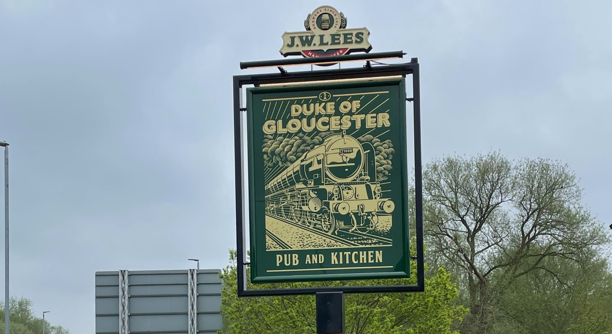

In 2024, your business signage is more than just a directional tool, it’s one of your most powerful assets in attracting foot traffic. While digital marketing is important, your physical signs are the first thing potential customers see, and they can make or break someone’s decision to step into your store.

The good news? By optimizing your signage, you can significantly boost foot traffic to your business.
Let's explore 5 ways to improve your signage and increase foot traffic in 2024.

## 1. Upgrade to Eye-Catching, Modern Signage

Your sign is your silent salesperson. It’s the first impression people get when they walk past your store, so it needs to be modern, vibrant, and reflective of your brand. Outdated, faded, or poorly designed signs can give potential customers the impression that your business is no longer relevant or that it lacks attention to detail.
In 2024, think about investing in:

- **LED signs**: These not only consume less energy but also offer brighter, clearer displays that attract attention day and night.
- **Illuminated signs**: Lighting makes your signage visible from a distance, ensuring your brand stands out even in low light.
- **3D signage**: Add dimension and depth to your signage to create a more professional and high-end look.

## 2. Use Signage to Tell Your Brand Story
Every business has a story, and your signage can be the perfect medium to tell it. Beyond just listing your business name, consider incorporating brand elements that communicate your company’s values, mission, or unique offerings. Whether it’s your logo, tagline, or a clever slogan, your sign should tell passersby who you are and what you offer in a way that resonates.

For example:

> A playful, modern font can communicate a trendy, innovative brand, whereas a classic, bold lettering can convey trustworthiness and heritage.

When potential customers feel a connection with your brand through your signage, they are more likely to walk through your doors.

## 3. Leverage Temporary Signage for Promotions

In addition to your permanent signage, temporary signs are a great way to capture the attention of passersby and create urgency. Highlight special deals or products during holidays or key shopping seasons. Temporary signs with bright colors or bold fonts can draw attention and encourage spontaneous foot traffic.

A well-placed A-frame sign on the sidewalk or a window decal can create curiosity and get people to stop and check out your offer. Make sure your messaging is clear, concise, and engaging.

## 4. Ensure Your Signage is Visible and Well-Maintained

Visibility is key. It’s one thing to have great signage, but if it’s not easily seen, or if it’s damaged or dirty, it could be hurting your business. Regularly inspect your signs to ensure they are free from wear and tear and fully illuminated.

A study found that 64% of consumers reported that dimly lit or hard-to-read signs made it difficult for them to find a business.

## 5. Incorporate Interactive and Digital Signage

In 2024, consider digital signage to bring your business to life. Interactive or animated signs not only attract 
attention but also engage people in a way traditional signage cannot. Digital signs allow you to:

- **Display dynamic content**: Rotate messages, showcase customer testimonials, or feature product videos.
- **Provide real-time updates**: Change promotions or announcements instantly based on time of day or inventory.
- **Engage customers with QR codes**: Encourage customers to scan a code on your sign that takes them to your website, special offer, or event details.

Interactive signage can be a conversation starter, drawing people in to explore your business further.

## What’s the Real Impact of Your Signage on Foot Traffic This Year?

In 2024, businesses need to do more than just put up a sign and open their doors. Whether it’s through eye-catching designs or digital interaction, your signs are working 24/7 to drive people into your business. Make sure they’re doing 
the best possible job!

With the right investment in your signage strategy, you can transform how potential customers perceive your business and dramatically increase foot traffic in 2024.

So take a fresh look at your signs, are they making the impact they should?