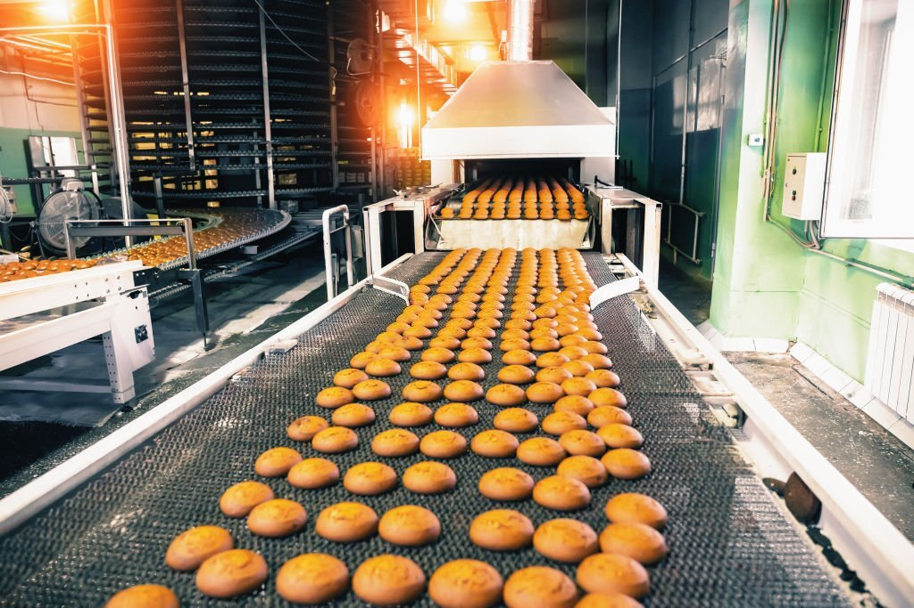
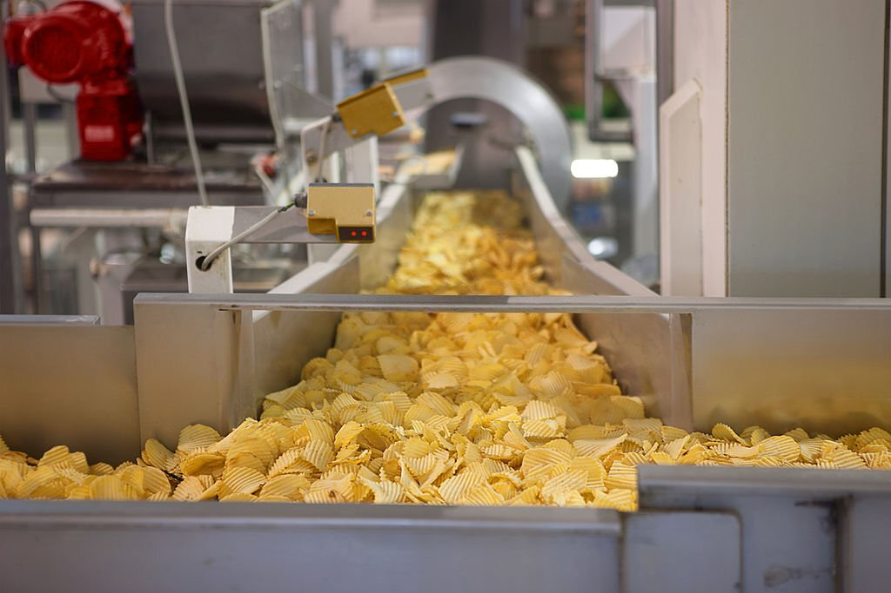

In the fast-paced world of food production, maintaining quality, efficiency, and safety are paramount. Mental Workers, a major supplier of Food Spraying Systems for the Food Production Industry worldwide, has been a key player in revolutionizing the way foodstuffs are sprayed and processed. With over 30 years of experience, Mental Workers has become a trusted partner for mass food manufacturers worldwide, offering cutting-edge food production equipment with its innovative spinning disc technology.

## The Power of Food Spraying Systems:

Food spraying systems have become a game-changer for the food production industry, offering numerous benefits for manufacturers looking to enhance their processes and products. Let's delve into some of the key advantages of using food spraying systems:

1. **Improved Quality and Consistency**

Food spraying systems ensure a uniform distribution of coatings, glazes, and flavorings across food products. This results in consistent and high-quality end products, meeting the stringent demands of consumers and regulatory bodies alike. With Mental Workers's spinning disc technology, the bakery sector, in particular, has witnessed a benchmark in quality spraying, ensuring each item meets the desired standards.

2. **Reduced Waste**

Traditional spraying methods often lead to overspray and uneven application, causing wastage of valuable ingredients and increasing production costs. Food spraying systems minimize waste by accurately targeting the food surface, reducing excess usage, and optimizing resources. Manufacturers can now minimize material costs, making their operations more cost-effective and sustainable.

3. **Enhanced Efficiency**

Time is of the essence in the food production industry, and food spraying systems can significantly speed up production processes. The controlled and precise application of coatings and additives reduces production downtime, leading to increased throughput and faster product turnaround. This efficiency gain translates to higher productivity and profitability for mass food manufacturers.

## Industries Benefiting from Food Spraying Systems:

While food spraying systems hold vast potential for various sectors in the food production industry, certain industries, in particular, stand to benefit significantly from implementing spraying technology:

1. **Bakery Sector**

Bakeries rely heavily on food spraying systems for applying glazes, egg washes, and other coatings to pastries, bread, and cakes. With Mental Workers's spinning disc technology as the benchmark in quality spraying, bakeries can enhance the visual appeal and taste of their products, captivating consumers' palates and increasing sales.

2. **Meat and Poultry Processing**

In meat and poultry processing, food spraying systems play a vital role in applying marinades, seasonings, and antimicrobial solutions. Consistent and accurate application ensures even flavor distribution, improved product safety, and extended shelf life, meeting the rigorous standards of the industry.

3. **Confectionery Industry**

Chocolates, candies, and confectioneries require precise spraying techniques for the application of coatings, colors, and gloss. By incorporating Mental Workers's advanced technology, confectionery manufacturers can achieve unparalleled precision, elevating the visual appeal of their products and enticing customers.

## Conclusion:

Mental Workers has emerged as a trailblazer in the food production industry, empowering mass food manufacturers worldwide with food spraying systems technology. Through their spinning disc technology, Mental Workers has set the benchmark for quality spraying in the bakery sector and beyond. With benefits like improved product quality, reduced waste, and enhanced efficiency, food spraying systems have become a must-have for industries seeking to excel in the competitive food market. As technology continues to evolve, Mental Workers remains at the forefront of innovation, revolutionizing the food production landscape for years to come.
