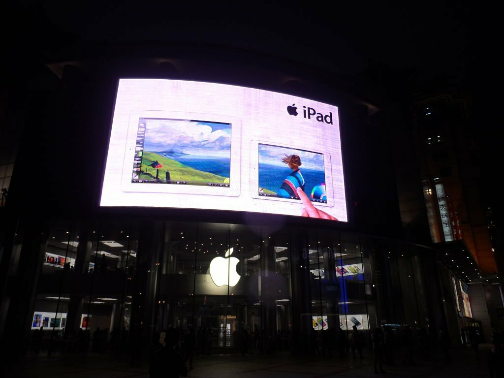

## The Necessity of Quality Signage

Signage plays a crucial role in every business, whether it's a retail store, a bustling hospitality venue, or a bustling manufacturing hub. From wayfinding to marketing, good-quality signage is essential.

Over the past few years, you've likely embraced new technologies to enhance efficiency, cut costs, and expand your business's capabilities. But have you considered the benefits of updating your signage to match the digital age?

## Exploring the World of Digital Signage

Just like traditional signage, including banner stands and building signs, digital signage can present text, graphics, and images. However, instead of being printed on fabric, plastic, or engraved materials, this information is showcased using LED digital screens.

Digital signs are incredibly versatile and serve as potent marketing and sales tools. They merge hardware and technology to deliver engaging content, often featuring motion and interactivity. The array of digital signage options includes digital displays, digital kiosks, digital menu boards, digital posters, and interactive screens equipped with point-of-sale capabilities.

## Harnessing the Power of Interactive Screens

For some businesses, a standalone LED screen is the perfect choice. These screens can display real-time updates, dynamic content with animations, carousels of images, and even videos. However, to fully leverage this technology, interactive digital screens offer practical solutions for various tasks while consistently promoting your brand.

From welcoming guests and facilitating check-ins at hotels and GP surgeries to streamlining order-taking in restaurants, interactive kiosks play a significant role. Art galleries, museums, and retail environments can get creative by hosting immersive interactive experiences. Once installed, updating graphics and content becomes a breeze, making them adaptable to changing needs.

## Top 5 Advantages of Digital Signage

### 1. Video and Dynamic Content
Digital screens are ideal for showcasing video content, from captivating showreels to the latest advertisements or instructional videos. They make your communications more engaging and dynamic.

### 2. Customizability
Unlike traditional signage that becomes static once printed, LED screens allow you to upload new graphics, text, or moving images instantly. Stay aligned with your evolving branding and messaging.

### 3. Swift Updates
Gone are the lead times associated with traditional signage updates. With digital systems in place, you can make instant updates using complementary software, ensuring your messaging is always current.

### 4. Interactivity
Digital signage offers the unique advantage of interactivity. Interactive kiosks, for instance, streamline processes like self-check-in, reducing administrative burdens on your staff while creating engaging experiences for your customers.

### 5. Continuous Innovation
At Sign Makers, we are dedicated to keeping our centers equipped with the latest sign-making technology. We consistently share industry innovations across our global network of experts, providing our customers with access to the best solutions. By investing in digital signage today, you position yourself to be among the first to benefit from future developments and upgrades.

Digital signage is a dynamic and efficient solution for businesses seeking to enhance their visual communication. Stay ahead in the digital age by embracing the power of Sign Makers' digital signage solutions.
