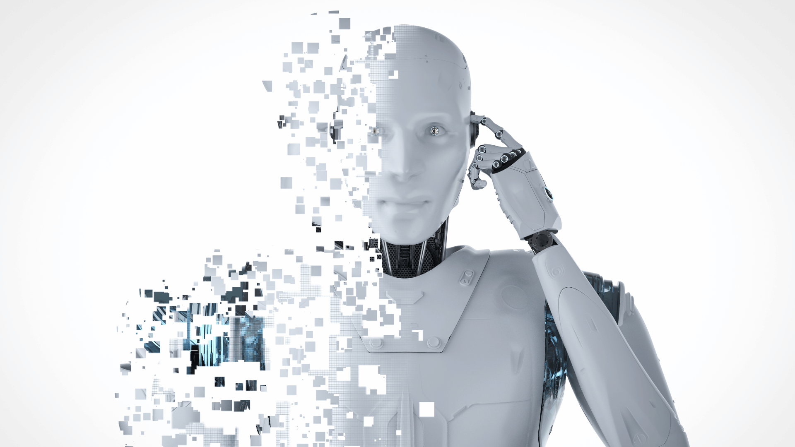
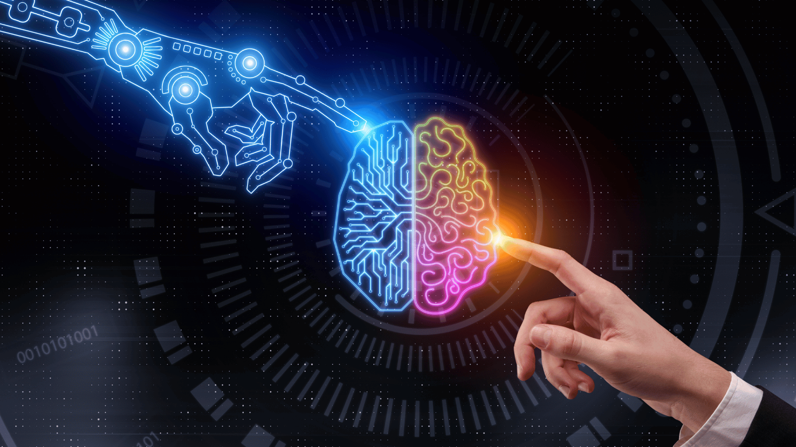

## AI and Humanity

As technology continues to advance, automation and artificial intelligence (AI) are revolutionising the way we approach sales, providing unprecedented opportunities for growth and efficiency. Equally, in an era of automation, personalised customer experiences are more important than ever. A common fear we have in our industry is that relying too heavily on AI and automation will erode the personal touch that has traditionally been a hallmark of successful sales and marketing. 

This is a big transformation and as exciting as the prospects sound, there are also some myths and misconceptions that some people hold (including myself). In this article, I debunk some of these myths, explore the vast opportunities that automation and AI present, discuss how we can leverage these advancements to our advantage and whether marketing and sales experts have anything to worry about.

### Fears, Myths or a Facts: Separating Reality from Fiction
> <i>AI will replace human sales professionals, making them redundant.</i>

I’ve heard my friends throw this myth around, and I understand.  While it's true that automation and AI have the potential to streamline certain repetitive tasks that were previously done by people, sales is fundamentally a human-centric discipline. The human touch, emotional intelligence, and relationship-building skills remain crucial for successful sales interactions. AI cannot replace sales professionals; instead, it is there to enhance our capabilities and empower us to focus on high-value activities.

> <i>Adopting AI requires a complete overhaul of existing sales processes.</i>

Embracing AI to enhance your business operations doesn't mean discarding tried-and-true methods. Traditional methods of doing sales still work. If we can reframe this thinking we can say, it’s about leveraging technology to enhance existing processes. This means automating repetitive tasks, to free up your sales teams to focus on strategic activities, such as building customer relationships, analysing data insights, and crafting personalized experiences. The future of sales lies in combining AI and traditional capabilities to create a powerful synergy.

> <i>Technology will override human expertise.</i>

Another fear is that relying on AI and automation will lead to a complete disregard for human expertise and intuition. The fact is, while technology can process vast amounts of data and provide valuable insights, it cannot fully replicate the emotional intelligence, adaptability, and empathy that humans bring to the table. So don’t let go of your team. The most successful businesses recognise the importance of human expertise and view AI as a supporting tool rather than a substitute. By combining the power of AI with human judgment and experience, we can make more informed decisions and deliver exceptional customer experiences. 

### Unveiling Opportunities: Where the Future Lies

1. <i>Enhanced Lead Generation</i>: AI-driven tools enable businesses to analyse data, identify patterns, and generate highly qualified leads. Remember that making data-driven decisions is what leads to sustainable growth. By leveraging predictive analytics, we can streamline lead generation efforts and focus on pursuing the most promising prospects.

2. <i>Personalisation at Scale</i>: With AI, we can deliver personalised experiences at scale. By analysing customer behaviour and preferences, using AI-powered algorithms we can tailor product recommendations, marketing messages, and customer interactions, resulting in higher engagement and conversion rates.

3. <i>Intelligent Sales Enablement</i>: AI-powered sales enablement platforms empower our teams with real-time insights, predictive analytics, and personalised coaching. These tools provide valuable guidance, equipping us with the information and strategies to close deals more effectively.

4. <i>Automated Sales Processes</i>: Mundane administrative tasks, such as data entry, order processing, and follow-ups, can be automated. This automation streamlines workflows, improves accuracy, and enables our teams to focus their time and energy on building relationships and closing deals.

### Finding Harmony: Coexistence of AI and Traditional Capabilities

As we embrace the future of sales, it's important to recognize that AI and traditional capabilities can coexist harmoniously to build sustainable economies. As mentioned above, AI cannot replicate the creativity, empathy, and intuition that humans bring to the table.

Business owners and marketing and sales professionals should focus on three key principles:

1. <i>Embrace Continuous Learning</i>: As AI technology evolves, it is essential to stay updated with the latest advancements and adapt accordingly. Invest in learning and upskilling initiatives to leverage AI tools effectively and stay competitive.

2. <i>Nurture Human Connections</i>: While AI can enhance efficiency and provide valuable insights, it is crucial to prioritise human connections. Sales professionals must focus on building authentic relationships, actively listening to customers, and understanding their unique needs and challenges.

3. <i>Tailor the Balance</i>: Striking the right balance between AI and traditional capabilities is key. Identify tasks that can be automated to maximize efficiency, but always remember the importance of the human touch in sales. Utilise AI as a supporting tool, allowing it to augment sales professionals rather than replace them.

### Paving the Way for a Bright Future

The future of sales lies in embracing automation and artificial intelligence, leveraging their capabilities to drive growth, efficiency, and customer satisfaction. By dispelling myths and misconceptions, we can recognise the vast opportunities that AI presents without fear of obsolescence. It is through the coexistence of AI and traditional capabilities that businesses can thrive, building sustainable economies and nurturing lasting relationships.

As sales and marketing professionals, our duty is to stay informed, adapt to technological advancements, and harness the power of AI to unlock our full potential. By embracing the future of sales, we can shape a world where technology and human ingenuity converge to create extraordinary customer experiences and drive business success. Together, let us embark on this transformative journey and unlock the endless possibilities that lie ahead.

This is another big topic, let’s continue the conversation on our [LinkedIn](https://www.linkedin.com/company/outsourced-sales-co/about/) Page and learn how to navigate this new world together.
