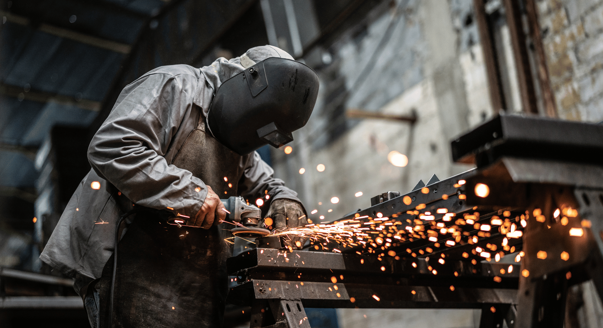

In a world driven by innovation and technological advancements, the age-old craft of metalworks continues to hold its unique charm. Enter the realm of Metal Workers, a company dedicated to the art of metal fabrication that combines age-old craftsmanship with cutting-edge technology.

## A Symphony of Skill and Precision

Metal Workers is not just a company; it's a testament to the artistry and expertise that can be achieved with metals. With a legacy spanning decades, they have honed their skills to perfection. When you think of metal fabrication, think of them as the artisans of steel, iron, and aluminum.

## The Craftsmanship Unveiled

### The Art of Welding

Welding is at the heart of metal fabrication, and Metal Workers has mastered it. Their welders are not mere technicians; they are artists who create seamless, strong, and beautiful joints. Whether it's ornamental ironwork or structural steel, every weld is a work of art.

### Custom Creations

Metal Workers takes pride in turning your imagination into reality. From intricate gates and railings that adorn homes to massive industrial structures that withstand the test of time, they are your go-to partner for custom metal projects. The only limit is your imagination.

### Architectural Marvels

Ever marveled at the awe-inspiring architectural marvels around the world? Metal Workers plays a pivotal role in creating these structures. Their structural steel forms the backbone of skyscrapers, bridges, and stadiums. It's not just about strength; it's about shaping the skyline.

### Restoring the Past

Preserving history is as crucial as building the future. Metal Workers specializes in restoring historic metalwork. From vintage railings to antique fixtures, they breathe new life into cherished pieces of the past.

## The Technology Advantage

While craftsmanship is at their core, Metal Workers understands the importance of innovation. They have invested in state-of-the-art technology that complements their skills. CNC cutting, laser engraving, and 3D modeling are just some of the tools in their arsenal, enabling precision and complexity that was once unimaginable.

## Sustainability Matters

In an era of environmental consciousness, Metal Workers is committed to sustainability. They use recycled materials whenever possible and employ eco-friendly practices. Their metalworks are built to last, reducing the need for replacements and conserving resources.

## A Team of Visionaries

Behind every piece of metalwork is a team of dedicated individuals who share a passion for their craft. The engineers, designers, and artisans at Metal Workers collaborate seamlessly to transform raw materials into works of art.

## Quality that Speaks Volumes

Quality is not just a buzzword at Metal Workers; it's a way of life. Their commitment to excellence is evident in every project they undertake. From the selection of materials to the finishing touches, nothing is left to chance.

## The Legacy Continues

As Metal Workers looks ahead, they are poised to continue their legacy of craftsmanship, innovation, and sustainability. They believe that metalworks are not just products; they are expressions of art and engineering.

So, the next time you gaze at a stunning piece of metalwork or marvel at a towering structure, remember that behind it, there's a company like Metal Workers, infusing passion and precision into every piece they create. Metalworks is not just their business; it's their calling, and their creations are a testament to their dedication to the art of metal fabrication.

In a world of metal, Metal Workers stands as a shining example of excellence. Their journey is a celebration of the enduring beauty and functionality that can be achieved with metal, reminding us that even in the age of technology, the craft of metalwork remains timeless.

