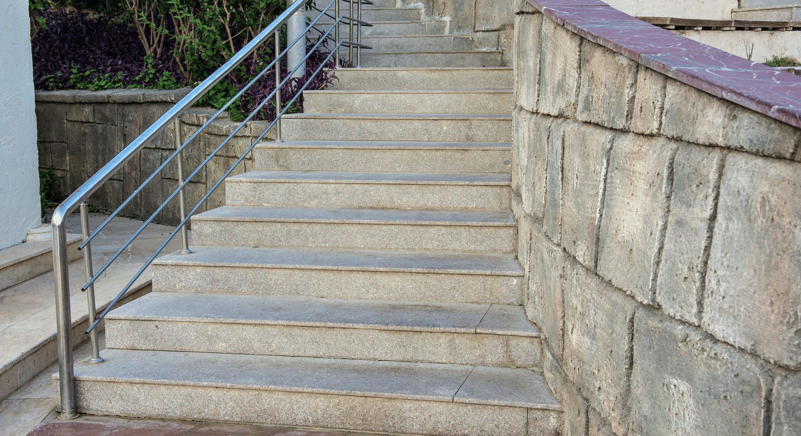

In the world of commercial architecture and design, functionality, safety, and aesthetics are of paramount importance. It's not just about constructing buildings; it's about creating spaces that leave a lasting impression. Balustrades and staircases, often overlooked but essential components, play a pivotal role in shaping the character of commercial establishments. Enter Metal Workers, a company that specializes in crafting architectural marvels in the form of stainless steel balustrades and staircases.

## Beyond Functionality: Aesthetic Excellence

Balustrades and staircases serve a practical purpose in commercial spaces, ensuring the safety and convenience of occupants and visitors. However, at Metal Workers, they go beyond mere functionality. They transform these utilitarian elements into works of art. Whether it's a sleek, modern stainless steel balustrade in a restaurant or an imposing staircase in a school, Metal Workers infuses each project with aesthetic excellence.

## Tailored Solutions for Diverse Businesses

One of the hallmarks of Metal Workers is their ability to provide tailored solutions for various businesses. They understand that the balustrades and staircases in a restaurant should reflect the ambiance of the establishment, just as those in a school should prioritize safety. Here are some examples of how Metal Workers has left their mark in different commercial sectors:

### Restaurants

In the competitive world of restaurants, the ambiance can make or break the dining experience. Metal Workers collaborates with restaurant owners and designers to create balustrades and staircases that enhance the visual appeal of the space. From sleek stainless steel railings in modern bistros to ornate balustrades in fine dining establishments, Metal Workers' craftsmanship is on full display.

### Schools and Educational Institutions

Safety is paramount in educational institutions. Metal Workers understands this and designs balustrades and staircases with the well-being of students and staff in mind. They combine safety features with elegant designs, ensuring that schools not only meet regulatory requirements but also provide an inspiring learning environment.

### Builders and Developers

Builders and developers trust Metal Workers to add value to their projects. Whether it's a residential complex or a commercial building, Metal Workers' balustrades and staircases become distinctive features that set properties apart from the rest. These elements don't just serve a functional purpose; they become selling points that attract buyers and tenants.

### Parks and Public Spaces

Even in parks and public spaces, Metal Workers' craftsmanship shines. Their balustrades provide safety without obstructing views, and their staircases offer accessibility while complementing the natural surroundings. These elements transform parks into inviting spaces for recreation and relaxation.

## Collaboration and Innovation

At the heart of Metal Workers' success is their commitment to collaboration and innovation. They work closely with architects, designers, and business owners to bring visions to life. Whether it's experimenting with new materials, creating intricate designs, or incorporating cutting-edge technology, Metal Workers is always pushing the boundaries of what's possible in the world of balustrades and staircases.

## The Perfect Balustrade for Your Business

In conclusion, balustrades and staircases are more than just structural components in commercial spaces—they are statements of style, safety, and sophistication. Metal Workers understands the unique needs of different businesses and delivers tailored solutions that elevate the overall appeal of commercial establishments.

So, whether you're a restaurant owner aiming to create a memorable dining experience, a school administrator prioritizing safety, a builder looking to add value to your project, or a park designer seeking to enhance public spaces, Metal Workers has the perfect balustrade and staircase solution for you.

Their legacy is not just in the metal they work with but in the lasting impressions they leave in the commercial spaces they transform. With Metal Workers, your business can stand out, making a statement that goes beyond words—a statement of craftsmanship, elegance, and functionality.