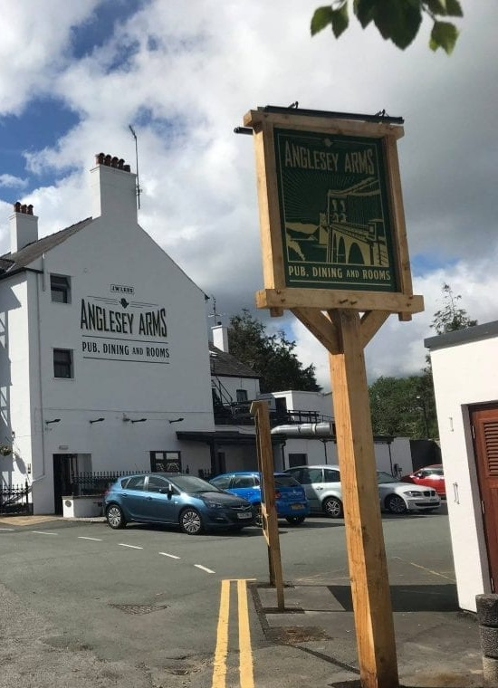
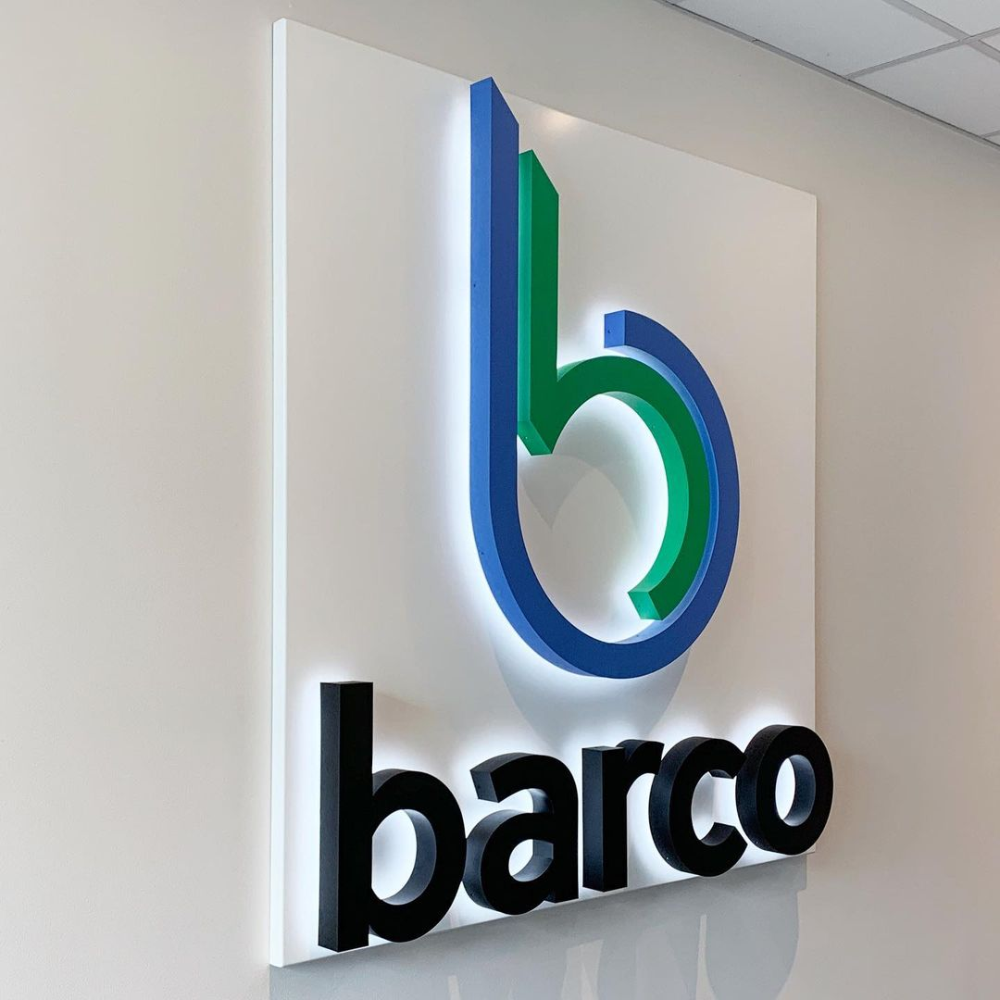
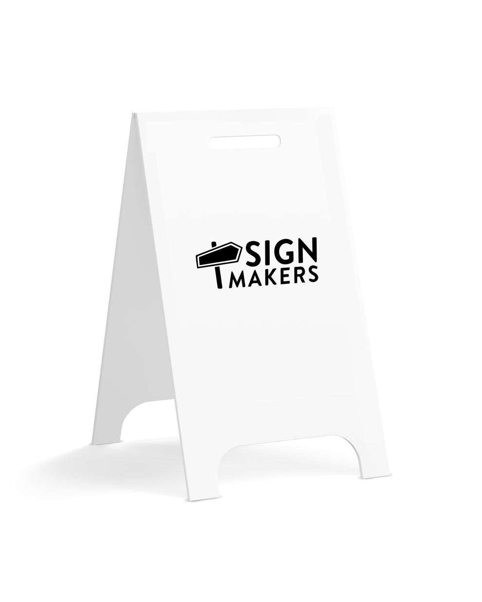
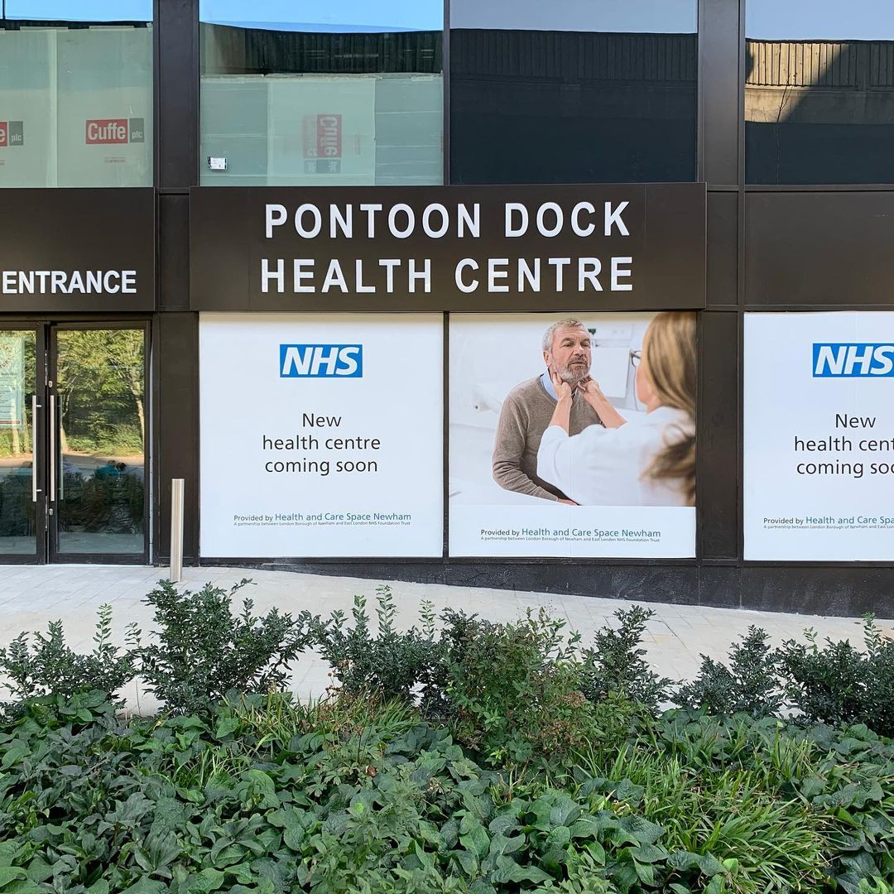

Did you know your business sign can be a 24/7 brand ambassador, working tirelessly to bring customers through your doors, even when you're closed? 

The truth is, your signage is one of the most powerful marketing tools at your disposal. It’s not just a sign, it’s your first impression, your brand’s personality, and a beacon for foot traffic.

But, here’s the question: Is your signage doing enough to turn heads and boost business?

If you're unsure or simply looking to improve, you're in the right place. Below, we’ll outline the four most effective signs that will not only attract attention but also drive real results for your business.

## 1. Monument Signs: Command Attention From Afar

Ever notice those [bold, imposing signs](/custom-signs/) at the entrance to shopping centers, hospitals, or corporate offices? Those are monument signs. They're designed to sit low to the ground, stand tall, and be impossible to miss, especially for drivers passing by.

Monument signs give your business a commanding presence and instantly create a professional, established look. Well-executed monument signs can showcase your logo, company name, or slogan and help create lasting impressions that scream, "We're here, and we're serious about what we do!"

**Pro Tip**: Don’t go generic. Make sure your monument sign reflects your brand identity, whether through material choices (wood, stone, etc.), lighting, or color.

## 2. Channel Letters: Light Up the Night

Is your business missing out on potential customers simply because your sign isn’t visible after dark? Channel letter signs are the shining solution. These 3D illuminated letters are not only eye-catching but are also perfect for [businesses that operate into the night, like restaurants, retail stores, or entertainment venues](https://shop.thesignmakers.com/collections/light-box-signs-illuminated-signs-uk-plug-buy-online-next-day-delivery).

Lighting sells. According to research, illuminated signage increases visibility by 55% at night, making your business stand out in a sea of competitors. With channel letters, your name becomes a beacon, guiding customers to your door even from a distance.

**Pro Tip**: Pair LED lighting with your channel letters for an energy-efficient, bright, and modern look. Plus, LED lighting is highly customizable, so you can match your brand’s color scheme exactly!

## 3. A-Frame Signs: The Ultimate Foot Traffic Magnet

Need to drive impulse traffic into your store? [A-frame signs (or sandwich boards)](https://shop.thesignmakers.com/) placed strategically on sidewalks are your best friend. These signs work like mini billboards, putting your latest offers, promotions, or simply the name of your business right in the path of potential customers.

A-frame signs are versatile, mobile, and attention-grabbing. They’re perfect for businesses in high foot traffic areas, think downtown shops, cafés, or salons.

Need ready-made [A-Boards](https://shop.thesignmakers.com/)? Look no further! The Sign Makers have got you covered with top-quality A-Boards and fast delivery. Find yours today!

**Pro Tip**: Keep your A-frame sign’s message simple and bold. Use chalk or erasable markers to change up the message daily or weekly. Try humor or urgency (“Today only!”) to spark immediate interest.

## 4. Window Graphics: Turn Your Front Window into a Billboard

Do you have big, beautiful windows facing the street? If so, you’re sitting on prime advertising real estate! Window graphics allow you to leverage that space to showcase key promotions, new products, or simply reinforce your brand with eye-catching designs.

You can change them seasonally or even monthly to keep your storefront fresh and engaging. Plus, they can provide privacy for customers inside while still catching the eye of those outside.

**Pro Tip**: Think beyond just your logo. Use window graphics to tell a story, highlight seasonal sales, or provide a sneak peek into what makes your business unique.

**Bold colors and high-contrast designs will ensure your windows work hard to pull in foot traffic.**

Here's an example of how we've helped companies with [Window Vinyl Graphics](/portfolio/pontoon-dock-health-centre/)

## Why Choose Effective Signs?

The right signage has the power to build trust, generate curiosity, and boost your bottom line by drawing in more customers.

Here’s the takeaway: **Your signs aren't just decorative; they're functional marketing tools that can work wonders when done right**.

## Looking to buy pre made signs? 

With experience serving over 500 companies, we’ve perfected their needs and made them available for you to purchase online. Our store offers a wide range of products including LED lights, business signs, storefronts, A-boards, Café menu boards, and much more. Explore our collection and [shop today](https://shop.thesignmakers.com/)!

Visit our store for more information [shop.thesignmakers.com](https://shop.thesignmakers.com/) 

**Ready to make your mark?** Now’s the time to evaluate your current signage. Is it working hard enough for your business? Looking for expert advice? [Contact us](/contact) today!
