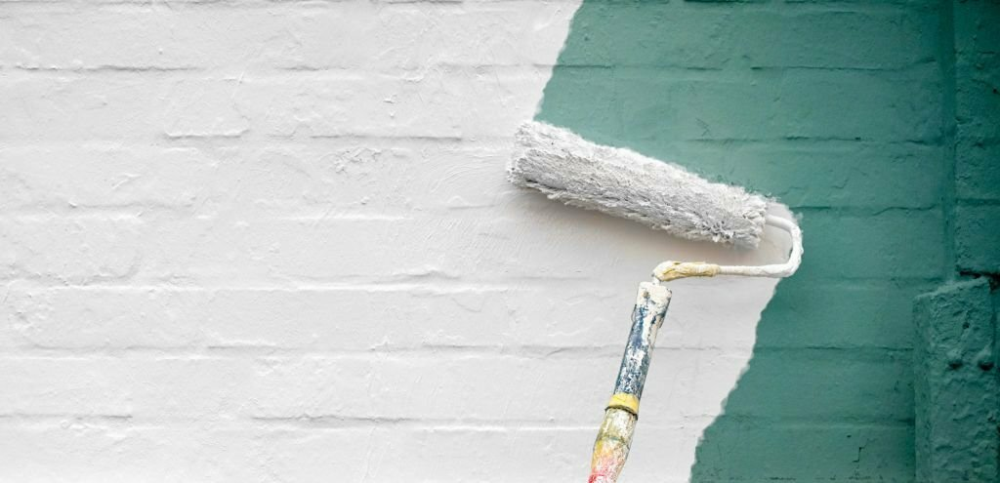
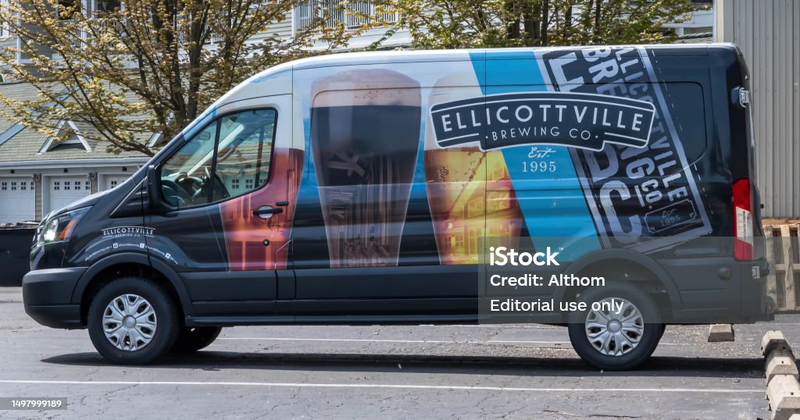
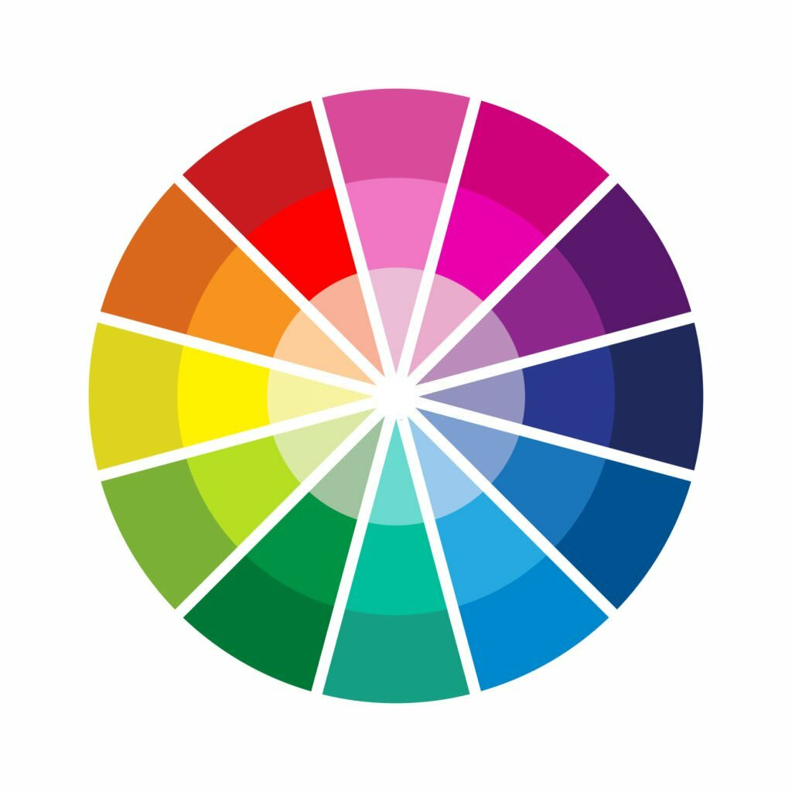
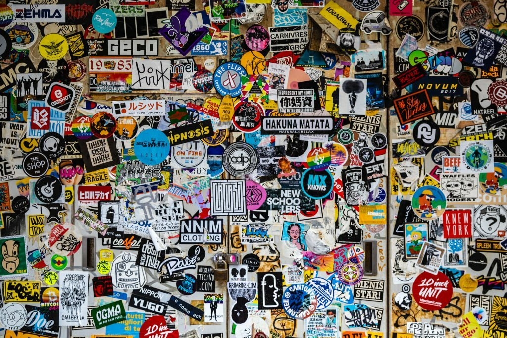

## The Art of Attraction: Leveraging Color Trends in Modern Signs & Custom Visuals

In recent years, color trends have gained significant popularity, extending beyond the official Pantone Color of the Year announcement. Behr, a renowned paint company, has unveiled their color of the year, "Cracked Pepper," a soft yet daring black that makes a sophisticated statement. While dark hues have often been taboo in the design world, design experts encourage people to heartily welcome the bold shade into their environments.

For marketers and business decision-makers who want to be “in the know,” what does the design trend around dark hues have to do with signs and graphics? Simply put, color, along with contrast, serves as the building blocks to attract visual interest, always a top consideration when considering high-impact visual solutions.

Cracked Pepper's paint color offers an ideal background to which contrasting colors can be accentuated and will have the greatest visibility. Admittedly, many of us have shied away from using dark colors or black in our business environments; however, it can be a way to embrace the trend while setting the stage for custom visuals and signage to really pop out, enhancing visibility, and designing custom visuals.

The concept of contrast to enhance visibility and attention isn’t new, and it’s not so far-fetched to incorporate bold colors into an environment or signage. Consider how nature exploits high-contrasting colors to stand out or communicate a message. The high-contrasted colors of yellow and black we see on bees serve as both a defense mechanism—or sign—to predators to stand back. This coloration is highly visible and easily recognized, even from a distance. Let’s not forget about the black and white of a zebra, the red of a rose next to the green of a petaled stem, and even blue and orange coming together in sunsets, birds, and fish. These contrasts easily capture the eye because they are both striking and beautiful.

If someone making decisions about signage, visuals, and graphics is thinking about leaning toward darker colors such as Cracked Pepper, what are the upsides?

- **Defines Shape:** Contrast creates visual interest and is carried out through elements from color to texture and size to shape. Think of it like the old adage - Opposites attract. Differences give definitions, but remembering to find balance is important. A healthy amount of dark or light space throughout a visual design provides viewers with the necessary breathing room. This breath of fresh “space” can better ensure the message is more easily seen or understood, not choked out by too many elements competing for attention.

- **Creates Visual Acuity:** Well-planned and contrasted colors across any graphic create visual acuity, the sharpness of what you see from a distance. Remember that chart that tests visual acuity when you visit the opticians? (It’s called the Snellen test.)

The contrast of the dark letters on the light background of that chart stands out. Contrast is also a tool to help increase visual acuity and, in turn, increase visibility. For signs and graphics, the goal is to create something that is easy to read. Why? Because people probably won’t take the time if it’s difficult. In fact, a lack of contrast can possibly lead to a missed opportunity to grab a potential customer.

When working with darker background colors, remember to keep the text lighter in hue. In fact, neon can be a great addition to make a dark wall really pop! Bold, chunkier fonts stand out better on a dark background, and incorporating texture, such as dimensional letters, allows for enhanced visual interest. When utilizing darker hues, it’s also important to use the color sparingly and often concentrated in one area.

- **Draws and Focuses the Eye:** To transform one area into a focal point, contrast plays a defining role. High contrast leads to high visibility. Our eyes are naturally drawn to the visibility of something heightened through it.

Whether it’s a piece of art against a dark wall or a white logo on oversized silos, contrast allows designers the ability to direct attention. Not only does it serve to grab customers' eyeballs, but it can also lead them to the most important information you want them to know.

When considering ways to get your brand noticed, dark colors can provide a backdrop that creates better contrast.

Contrast enhances the power of visibility as it defines shape, creates visual acuity, and draws the eye. The design experts at Sign Makers are masters in the design of attraction and can create bold, eye-catching visual solutions for your business. Call us today!
