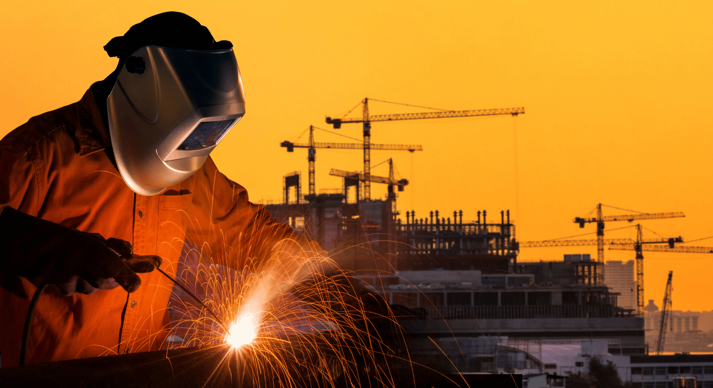
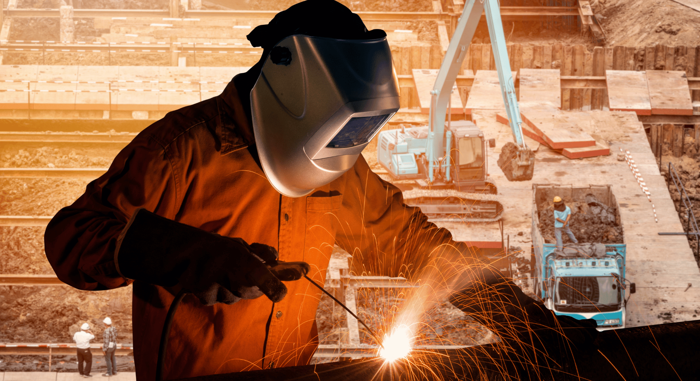
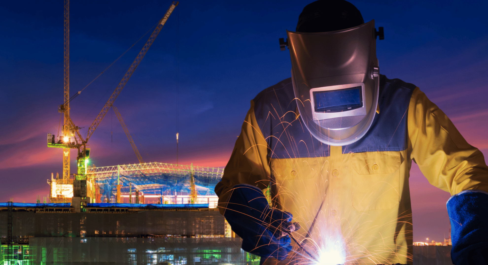

# The Artistry of Architectural Metalwork: Unveiling the Craftsmanship of Metal Workers

In the ever-evolving world of architecture, where innovation and creativity know no bounds, one element continues to stand as a testament to both form and function—architectural metalwork. It's the intricate details of iron balustrades, the graceful curves of steel sculptures, and the robust structures of metal bridges that define not just the skyline but the essence of architectural marvels. And at the heart of this craftsmanship lies a name synonymous with excellence—Metal Workers.

## A Legacy of Excellence

Metal Workers, a company with a rich legacy spanning decades, has elevated architectural metalwork to an art form. They are not just metalworkers; they are visionaries who transform raw materials into breathtaking pieces of art that adorn buildings, parks, and public spaces worldwide.

### The Symphony of Materials

One cannot speak of architectural metalwork without acknowledging the diverse range of materials that Metal Workers masterfully manipulate. From the classic elegance of wrought iron to the contemporary allure of stainless steel, each material is carefully chosen to harmonize with the architectural vision.

### Crafting Timeless Elegance

Metal Workers understands that architectural metalwork is more than just construction; it's an expression of creativity. Their craftsmen meticulously forge every piece, ensuring that each curve, angle, and joint reflects the designer's vision. Whether it's a grand staircase in a historic mansion or a modern sculpture in a public square, Metal Workers' commitment to perfection remains unwavering.

### Bridging the Past and Future

One of the most remarkable aspects of architectural metalwork is its ability to bridge the past and future. Metal Workers specializes in restoring historic metalwork, breathing new life into cherished pieces of the past. They painstakingly preserve the essence of these treasures while ensuring they meet contemporary structural standards.

### Innovative Techniques

While tradition forms the foundation of their craft, Metal Workers also embrace innovation. They employ cutting-edge technologies such as CNC plasma cutting and 3D modeling to push the boundaries of what's possible in architectural metalwork. These techniques enable them to create intricate designs and complex structures that were once unimaginable.

### Sustainable Practices

In an era where sustainability is paramount, Metal Workers takes pride in their eco-friendly approach. They use recycled materials whenever feasible, reducing waste and conserving resources. Their commitment to sustainable practices extends not only to the environment but also to the longevity of their creations.

### Collaboration and Vision

Behind every exquisite piece of architectural metalwork is a team of dedicated individuals at Metal Workers. Architects, designers, and craftsmen collaborate seamlessly, each contributing their expertise to transform blueprints into reality. Their passion for their craft is evident in every project they undertake.

## Conclusion

In the world of architectural metalwork, Metal Workers is a shining example of excellence. Their dedication to preserving tradition while embracing innovation has resulted in iconic structures that grace our cities. As we marvel at the intricate details and timeless elegance of architectural metalwork, let us also celebrate the artisans at Metal Workers who breathe life into steel, iron, and aluminum.

Architectural metalwork is not merely a construction element; it's a fusion of art, engineering, and imagination. It's a reminder that in the world of architecture, the possibilities are limitless, and with craftsmen like Metal Workers, our cities will continue to be adorned with breathtaking metal masterpieces for generations to come.

As you gaze upon the next architectural wonder, take a moment to appreciate the craftsmanship of Metal Workers—a company that transforms metal into art and elevates the world of architecture to new heights. Their legacy is not just in the structures they create but in the inspiration they provide to architects and dreamers alike.
