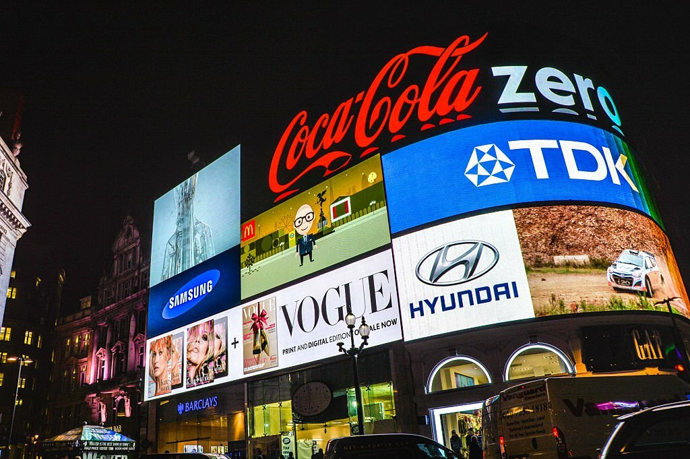
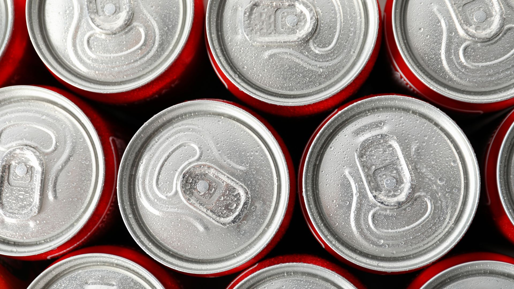
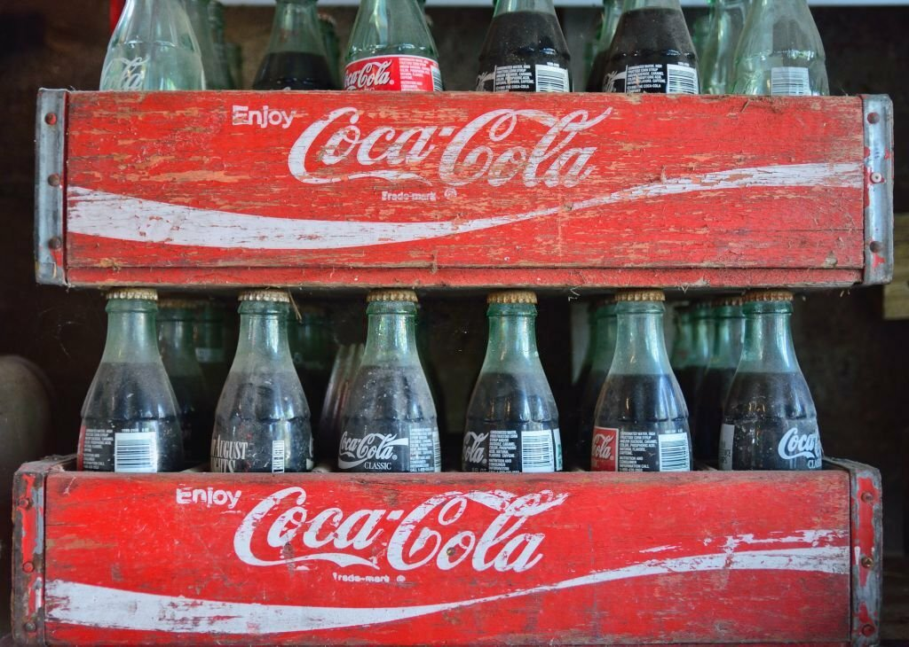
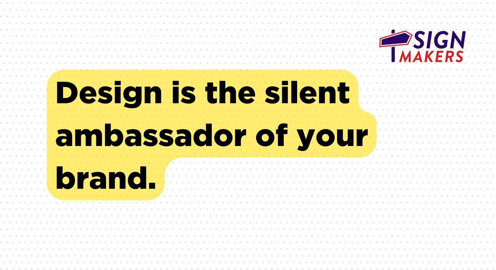

# Unleashing the Power of Signage in Rebranding: 4 Things to Consider

In the dynamic landscape of marketing, we’re experiencing a resurgence of rebranding. Rebrands are a strategic marketing maneuver that can redefine or refresh a company or brand’s identity and set it on a trajectory for future success. While there are numerous elements to consider during a rebrand, signs and graphics are pivotal pieces in the rebranding process, acting as powerful ambassadors for brands as well as businesses that need to attract attention to get customer traffic.

In fact, 60% of companies that refreshed their signage saw traffic increases of over 10%.* With so much goodwill and value of a company tied to the brand, marketing decision-makers and business owners take rebranding very seriously.

Advertisers know people rely on emotions to make brand decisions, and quality signage can bring out a range of emotions for customers. Because of this, many of the most notable recent rebrands are tapping into emotions and nostalgia from McDonald’s to Burger King, Coop to Natwest, as well as more recent controversial rebrands such as HBO to Max and Twitter to “X.”

Then there’s the recent Nokia rebrand with an updated logo that includes a new look and color pallet to reflect their modern business practices, technology advancements, and current fashion trends.

Rebrands receive attention and often tap into emotional frameworks and associations people already have for brands. A finding from an opinion poll conducted by Sign Makers reveals that quality signage brings out a range of emotions for customers, and more than two in five of those surveyed say signage makes them feel something, 41% say it makes them feel energized or excited.

“When more people perceive a brand or a business as dynamic, popular, and on-the-move, it’s the kind of brand people choose to engage in business. It’s a key indicator of brand strength, brand momentum, and continued opportunity for growth,” said Jennifer Herskind, Chief Marketing Officer of Sign Makers.

To be a brand that people choose to engage in business, here are four ways dynamic signage and graphic solutions can play an important role in your rebranding efforts:

## First Impression

Signage is often what makes your brand's first impression. Be it a monolith sign, an exterior sign, a billboard, or a digital sign, it's often the first visual element that people attach to your brand. During a rebrand, updating your signage to reflect your new brand identity is not just important, it's a strategic imperative.

## Projecting Your Brand Identity

Your signage should be more than just a nameplate; it should be a mirror projecting your brand's identity. It should embrace your brand's personality and image, everything from the color scheme and typography to the logo and messaging. Carrying this as a visual scheme throughout an environment or business can convey volumes about your brand stature, quality, and value proposition. When rebranding, ensure that your signage aligns seamlessly with your new brand identity, effectively communicating the essence of your brand both internally and to the world.

## A Key Player in Brand Recognition

Consistent and well-designed signage can significantly amplify brand recognition. By maintaining consistency in your graphic identity across all customer touchpoints, both in the physical world and the digital world, you can ensure that your brand identity is strategically and consistently integrated.

## Signage: A Catalyst for Getting Noticed
Signage isn't just about brand recognition; it's also a powerful catalyst for getting noticed. Larger-than-life graphics, digital displays, and creatively designed signs can pique customer interest and encourage people to do a double take. This can be particularly effective during a rebrand, helping to generate buzz and excitement around your new brand identity.

“Rebranding is a large undertaking but a winning recipe that will drive success: Think …

Signage, graphics, and custom visuals play a pivotal role in the rebranding process. It's not just about changing logos or colors; it's about creating a visual representation of what you want your brand to stand for that resonates with your audience, boosts brand recognition, and gets you noticed.

*The Economic Value of On-Premise Signage by The University of Cincinnati*
