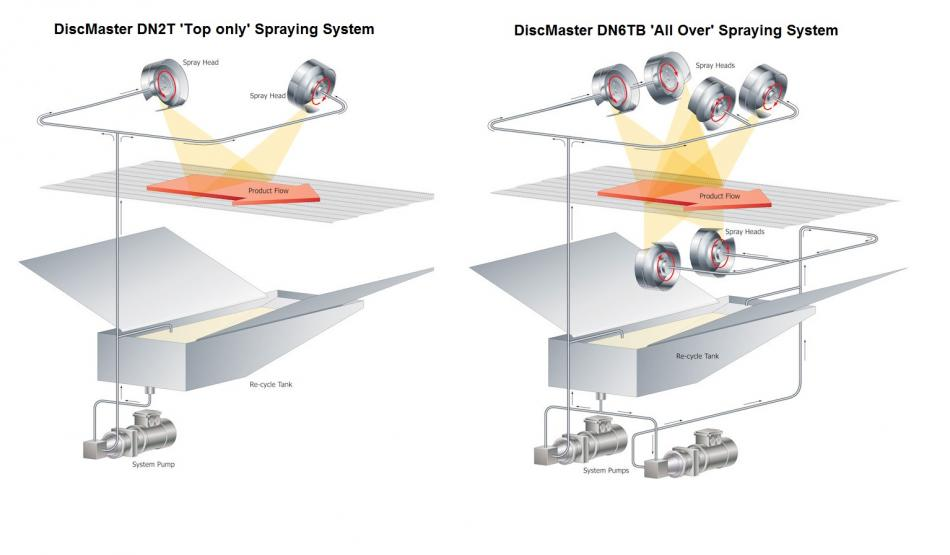

# The DiscMaster™ Spraying System

  <iframe src="https://www.youtube.com/embed/drWnTtA2bRw" style="position: absolute; top: 0; left: 0; width: 100%; height: 100%; border: 0; border-radius: 8px;" allowfullscreen="" frameborder="0"></iframe>

The DiscMaster™ series of Spraying Machines have been designed as the versatile system of choice for small to medium-scale business. It provides the important economies of scale and manufacturing flexibility that such operations demand. High operational uptime is achieved by the blockage-resistant spray delivery system, which, coupled with easy maintenance access, minimizes downtime and delivers a quick ROI for business managers. Transportable on castors for easy relocation within the factory, it can be used as either a stand-alone offline unit or integrated into a small production facility.

Configured during manufacturing to provide Top, Top & Sides, or All Over Spray Coverage, these machines utilize the same proven spinning disc spray technology, previously associated with professional-level equipment. For operation at temperatures other than ambient, the heating/chiller packs can maintain the unit at the appropriate temperature for either heated or chilled spraying operations.

Operationally, the DiscMaster™ offers repeatable precision in the application of spray material, previously unavailable at this investment level. Precision Inverter/Motor Control Systems provide digital control to the Spinning Disc Speed, Pump Speed and the Conveyor Speed, allowing full control over the droplet formation and deposition of the spray material. Recording the setting of the digital potentiometer for each of the key control systems provides a unique digital signature for each machine set-up. Product changeovers can be quickly accommodated by entering the signature code into the machine for the appropriate machine configuration. The precision accuracy inherent in the system ensures it correctly returns to an identical set-up as the last batch of that particular product. A proportion of the pump output is returned directly to the reservoir tank, which provides:

- Improved control of the spray application rate
 
- Continuous re-circulation which inhibits the separation of emulsions
 
- Enhanced temperature stabilisation of the spray material

## DiscMaster™ Spraying System Schematics

### Operational Benefits

- High Quality Output: Saturn offers bespoke manufacturing solutions that are based on our patented spinning disc technology. We provide varying degrees of product coverage from 'Top Only' to 'Total Coverage' within our product range.
- Full Product Coverage: We provide a full range of products that accommodate coverage options from 'Top Only' to 'Total Coverage'. The desired product spray can range from single disc machines that give single-side coverage to a product, to multiple discs that can be positioned above and below the product conveyor line and angled to provide the desired total product coverage.
- High Throughput: Saturn's systems can maintain a consistent, even density of product coverage, even with higher conveyor speeds. The spinning disc technology, a nozzle-less application method, is resistant to blockages and uneven spread patterns.
- Precision and Control: Precision Inverter/Motor Control Systems provide digital control to the Spinning Disc Speed, Pump Speed, and the Conveyor Speed, allowing full control over the droplet formation and deposition of the spray material.
- Quick Product Changeovers: Incrementing/decrementing the code on the digital potentiometers alters the performance of the system's conveyors and pumps to the required level, ensuring perfect re-registration of the system set-up from one production batch to another.
- Environmentally Friendly: Saturn's patented spinning disc technology is seen as a safe and environmentally friendly spray coating system for modern work environments.

## System Construction

Built as a single integral unit with removable access panels and stainless steel pipe work, the DiscMaster™ is designed for ease of cleaning and maintenance. When configured for both top and bottom spraying, there will be a minimum working height for the conveyor belt. The Standard Disc Motor supplied is an IP66 Stainless Steel which provides a high level of water protection with an excellent cosmetic finish. It allows for easy cleaning as well as ease of maintenance.

The width of the machine can be selected to suit either the application or the existing conveyor belt width. The machine series can accommodate line widths up to 700 mm. The maximum number of spray heads on the top is four with two spray heads fitted underneath.

The standard length of the machine is 1000 mm, but the in-feed and out-feed can be extended as required to meet system installation requirements. Conveyor belts can be either stainless steel wire enrobing for loose product or chain drive for trays. The maximum belt width available with the DiscMaster™ series is 700 mm.

## System Configuration Options

- Low Sensor Level & Beacon: A visual warning by an amber flashing beacon indicates that the reservoir requires topping up.
- Extended Conveyor: When used in a standalone offline configuration, extending the length of the conveyor in-feed and out-feed sections allows trays and/or loose products to be loaded and off-loaded with ease.
- Conveyor Snub Nose: Snub Noses extensions on either the in-feed or out-feed conveyor section provide versatile interface requirements for mating with adjacent conveyor systems.
- Conveyor Mist Covers: This option is highly recommended when the machine is used for the spraying of oils. The covers provide a simple mechanism to reduce the entry aperture of the spraying machine to the minimum clearance necessary for the product to transit the machine.
- Sealed Stainless Steel IP66 Disc Motors: The Standard Disc Motor supplied is an IP66 Stainless Steel which provides a high level of water protection with an excellent cosmetic finish.
  
## System Materials

The machine is constructed in stainless steel grade 304, with pipework in 316-grade steel. All components in direct contact with the material being sprayed and the product are stainless steel or other food quality materials. The design ensures all areas of the machine are fully accessible for cleaning, and every effort is made to ensure the hygiene aspects of the machine are to the highest possible standard.

## System Electrical Requirements

These machines require a single-phase mains power connection for operation. The equipment will be configured to work with the standard single-phase voltage systems in the country of operation. Note: If a Temperature Control System is integrated into the unit, then a 3-phase supply will be required.

UK Power Requirements: 240V Single Phase 50Hz & Earth
