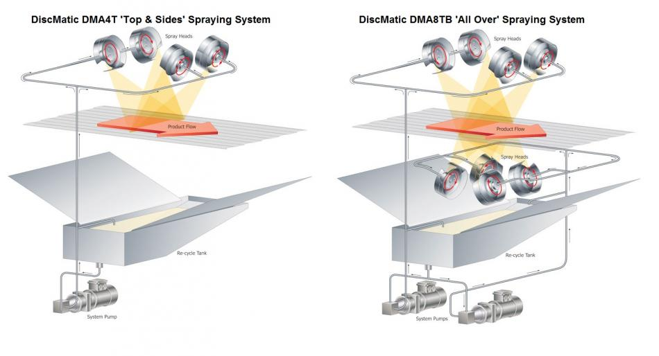
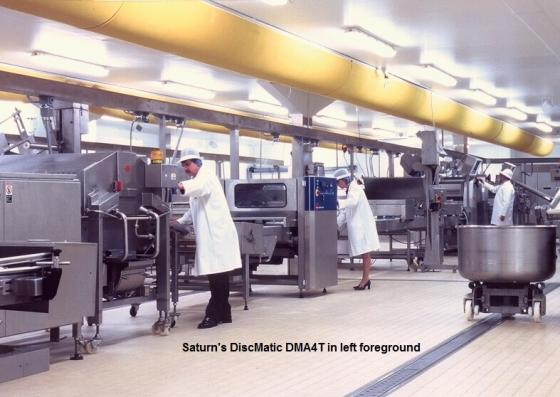
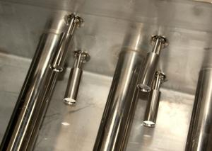

# The DiscMatic™ Spraying System

  <iframe src="https://www.youtube.com/embed/3u0Ng7Ix31o" style="position: absolute; top: 0; left: 0; width: 100%; height: 100%; border: 0; border-radius: 8px;" allowfullscreen="" frameborder="0"></iframe>

The DiscMatic™ Series of Spraying Machines have been designed with the professional operator in mind. The design lends itself to the spraying of a wide range of glazes, oils, and flavorings. With repeatable precision, liquids and emulsions can all be sprayed. For operation at other than ambient temperature control, the heating/chiller packs can maintain the unit at the appropriate temperature for either heated or chilled spraying operations.

The system can be configured for Top, Top & Sides, or All Over Spray Coverage by the number and positioning of the Spinning Discs. All the discs operate in ganged pairs and are belt driven from inverter-motor sets. Operationally, the DiscMatic™ offers highly repeatable precision in the application of spray material. Precision Inverter/Motor Control Systems provide digital veneer control to the Spinning Disc Speed, Pump Speed, and the Conveyor Speed, allowing full control over the droplet formation and deposition of the spray material. Recording the setting of the digital potentiometer for each of the key control systems provides a unique digital signature for each machine set-up. Product changeovers can be quickly accommodated by entering the signature code into the machine for the appropriate machine configuration. The precision accuracy inherent in the system ensures it correctly returns to an identical set up as the last batch of that particular product. A proportion of the pump output is returned directly to the reservoir tank, which provides:

- Improved control of the spray application rate
- Continuous re-circulation that inhibits the separation of emulsions
- Enhanced temperature stabilization of the spray material

## DiscMatic™ Spraying System Schematics

The professional robust nature of the <b>DiscMatic™</b> machine finds its use in production environments where high utilization rates are the norm. Our blockage resistant design and ease of system maintenance contribute enormously to the system’s overall success. The <b>DiscMatic™</b> is available in belt widths ranging from 600 mm to 1600 mm.

The <b>DiscMatic™</b> is fitted with a flashing amber warning beacon that gives warning when the system reservoir needs topping up. The reservoir level sensor triggers the beacon when the level of the reservoir falls below a recommended level.

## DiscMatic Operational Benefits

- High Throughput: Saturn’s systems can maintain a consistent, even density of product coverage even with higher conveyor speeds. The spinning disc technology uses a nozzle-less application method that is resistant to blockages and uneven spread patterns experienced elsewhere. The minimum orifice in a spinning disc system is 8.0 mm. Precision, control, quality, and reliability are essential components in modern manufacturing dynamics, with the system’s synergy ensuring a speedy return on the capital investment.
- Full Product Coverage: We provide a full range of products that accommodate coverage options from ‘Top Only’ to ‘Total Coverage’. The desired product spray can range from single disc machines, which give single-side coverage to a product, to multiple discs, which can be positioned above and below the product conveyor line and angled to provide the desired total product coverage.
- Bespoke Product meets your Exact Requirements: Saturn offers bespoke manufacturing solutions that are based on our patented spinning disc technology. Since it is a bespoke solution, there are no compromises or workarounds that can affect the dynamics of the production system. We are able to provide varying degrees of product coverage from ‘Top Only’ to ‘Total Coverage’, within our product range.
- Quick Production Changeovers: Incrementing/decrementing the code on the digital potentiometers alters the performance of the system’s conveyors and pumps to the individual level required. This can be entered manually or by an external PLC Controller. On a non-dedicated production line, our precision incremental control ensures perfect re-registration of the system set-up from one production batch to another.
- Protecting the Working Environment: In order to achieve greater product throughput, nozzle spraying systems often need to use higher line air pressures to maintain the cover density. Unfortunately, there is a hazard to spray atomization that requires careful control and even on occasion’s expensive extraction equipment to maintain a safe work environment. Saturn’s Patented Spinning Disc Technology has none of these drawbacks and is often seen as the safe, environmentally friendly spray coating system to choose for modern work environments.

## System Construction

The DiscMatic™ unit is designed to disassemble into two manageable units for ease of maintenance and system cleaning:

1. Conveyor Unit: A 1990 mm long conveyor on which the products to be sprayed are transported. Whilst this is the typical length, other sizes are available. The unit is mounted on height-adjustable castors.
2. Spray Head Unit: The spray head(s) which include the material storage tank and pump unit is mounted on height-adjustable castors.

System Assembly: The video below shows the two parts of the DiscMatic System engaging and disengaging.

  <iframe src="https://www.youtube.com/embed/Njtm6nyvTDA" style="position: absolute; top: 0; left: 0; width: 100%; height: 100%; border: 0; border-radius: 8px;" allowfullscreen="" frameborder="0"></iframe>

### Standard Configuration Options

- System Auto-fill Valve & Traffic Light Display: Four level sensors are fitted to the internal reservoir, two pairs of sensors for both the high-level and low-level settings are provided for fail-safe operation.
- High-level Failsafe Overfill Level
- High-level Operational Level
- Low-level Operational Level
- Low-level Failsafe Damage Level

The Saturn Spraying System auto-fill option provides a signal to an external spray material reservoir, its pump, and its associated control system. This signal allows the external control system to initiate and suspend the pumping of liquid into our reservoir tank.

The low-level fail-safe damage level sensor is used within the Saturn Spraying Unit to shut down the system pump, ensuring it does not operate dry and risk being damaged.

This option also includes an 'At-a-Glance' tower status light unit, which provides a visible check of the machine's operational status. The three light display of Red, Amber, and Green with the Red light positioned uppermost is positioned prominently on the machine.

- Green is used to indicate that the machine is operating within normal parameters.
- Amber signifies the need for operator intervention, such as refilling the material reservoir.
- Red requires a machine stop. An example here is where the level of the spray material in the reservoir tank had gone below the reminder level and is now at a level where damage could occur to the system pumps if they run dry. The system pumps will have been stopped. The red light will remain lit until manually reset.

- In-Feed & Out-Feed Inclined Conveyor Height Change Units: When the DiscMatic™ is used in a 'Top & Bottom' spraying configuration, the minimum operational height of the conveyor is set to 1350 mm. This allows clearance on the machine for both the spinning disc assembly and the reservoir pump assembly. Height differentials between the factory conveyor system and the DiscMatic™ can be accommodated with inclined in-feed and out-feed conveyors.
- Mist Extraction: A Single Filtermist® extraction unit is available where oil misting is possible. It will centrally fit on the spray head where it will minimize any potential misting of the spray oils. In some situations, two Filtermist® units can be used in conjunction to reduce misting. One unit will be fitted on the product inbound side, the other on the product outbound.

## System Materials

The machine is constructed in stainless steel grade 304, with pipework in 316-grade steel. All components in direct contact with the material being sprayed and the product are stainless steel or other food quality materials. The design ensures all areas of the machine are fully accessible for cleaning, and every effort is made to ensure that the hygiene aspects of the machine are to the highest possible standard.

## Electrical

The system requires a 'Clean' Three Phase Supply.
UK Power requirements are: 415V 3Ph 50Hz + Neutral + Earth.
