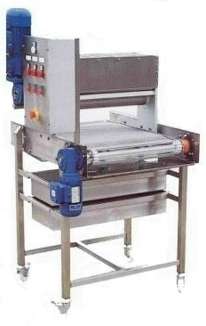
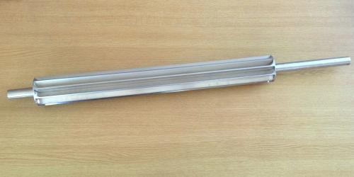

# Sprinkling Machine

  <iframe src="https://www.youtube.com/embed/495J-fBhfi4" style="position: absolute; top: 0; left: 0; width: 100%; height: 100%; border: 0; border-radius: 8px;" allowfullscreen="" frameborder="0"></iframe>

Granular products such as sugars, nuts, dried herbs, breadcrumbs, and various seeds such as poppy, sesame, and cracked wheat can be evenly sprinkled on the top of produce using Saturn's sprinkler. The sprinkler head is mounted over its own integral conveyor.

The machine uses an interchangeable, grooved roller that is driven by an inverter-controlled electric motor. The roller is mounted on the bottom of a hopper, into which the granular material to be sprinkled is placed. As the roller rotates, granular products in the hopper are gravity-fed to engage with the grooved roller. The grooves pick up the granules and rotate through 180 degrees. The granular products are now free to drop by gravity onto the products directly underneath the roller. The application rate is regulated by adjusting the speed of rotation of the roller, using the digital potentiometer in the control cabinet. The grooves in the roller are machined to accept the granular size of the product being sprinkled. Where different granular sizes of products are to be used, interchangeable application rollers may be required for each product.

All material that misses the product as it passes through the machine falls through the belt and is collected in a double catchment tray system, allowing the unused product to be manually recycled by emptying one tray back into the hopper. This is carried out without stopping the machine while the other tray remains in use. The conveyor, which is integral, is driven by an inverter-controlled electric motor and incorporates a Stainless Steel Wire Enrobing Belt.

<!--  -->

The machine is constructed in stainless steel grade 304. All components in direct contact with the material being sprinkled or the products are in stainless steel or other food quality materials. The machine is mounted on casters, two of which are lockable. The machine is built to complement the spinning disc machines for 'in line' operations, with an integral conveyor. Two catchment trays are positioned under the conveyor to retain the product and allow manual recycling, without stopping the line.
