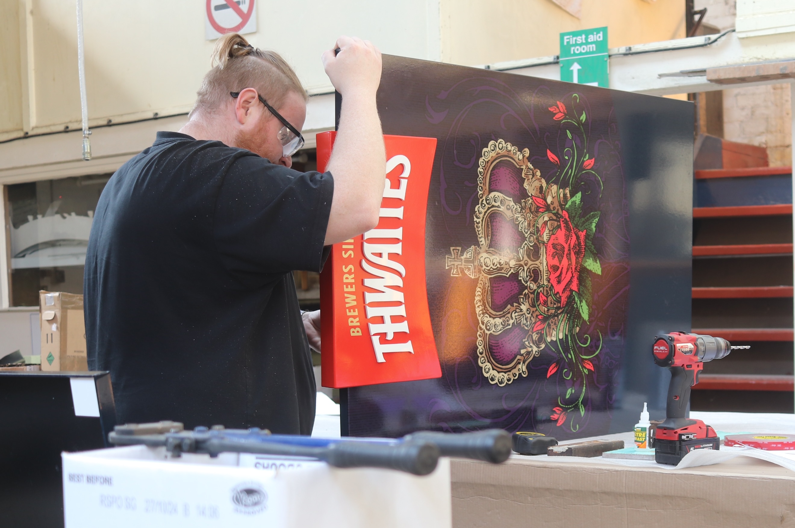
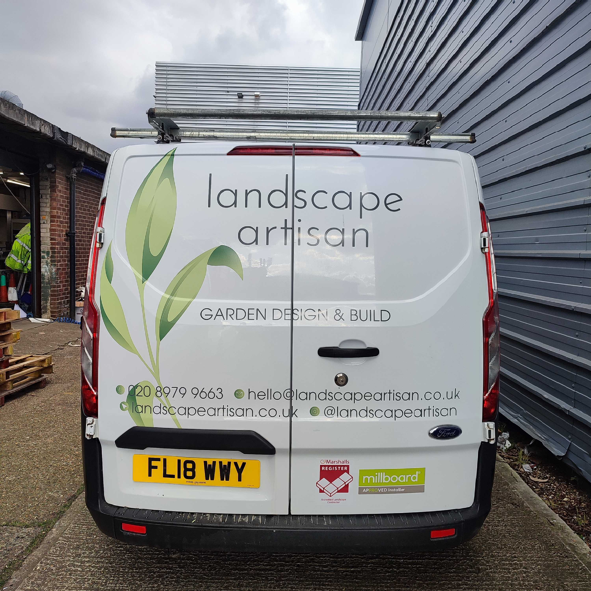
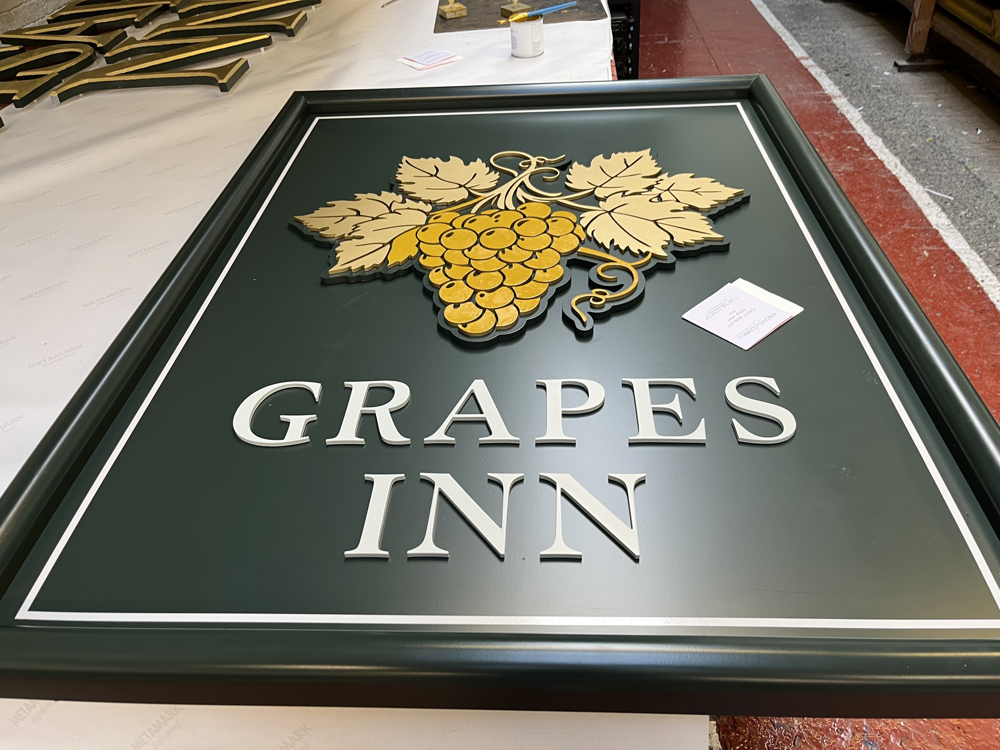

# Art Work

### Transforming Ideas into Visual Masterpieces

Whether you're looking for expert advice on styles, colors, and typefaces or need assistance with design ideas and branding, our team is here to bring your vision to life.

We are committed to transforming your ideas into visual masterpieces. From efficient and cost-effective solutions to a collaborative design process, our focus is on elevating your brand through design excellence.

Our studio boasts a highly qualified and experienced graphic design team dedicated to offering a wide array of design services.

### Tailored Designs for Your Brand

At The Sign Makers, we offer customized design services that reflect your brand’s unique identity. Whether you need eye-catching logos, bold storefront signs, or informative interior displays, our team creates designs that communicate your message effectively and leave a lasting impression on your audience.

### Expertise in a Variety of Sign Types

Our skilled designers specialise in a wide range of sign types, from outdoor banners and window graphics to wayfinding and safety signage. We understand the unique requirements of different sign applications and ensure that each design is suited to its purpose, environment, and audience.

### Collaborative Process and Attention to Detail

We believe in a collaborative approach, working closely with our clients to understand their needs and vision. From concept to completion, our team pays attention to every detail, ensuring that the final product not only meets but exceeds expectations. The result is a professionally designed sign that perfectly aligns with your business goals.

Choosing The Sign Makers for your design needs ensures you get high-quality, tailored solutions that truly reflect your brand’s identity. Our experienced team specializes in creating a wide range of signs, from striking storefront displays to informative interior graphics, all designed to communicate your message clearly and effectively. We work closely with you through a collaborative process to understand your specific requirements and goals, delivering custom designs that stand out and make an impact. With a focus on creativity, precision, and client satisfaction, The Sign Makers are committed to providing designs that enhance your brand and help your business succeed.

### Design Studio Excellence

Our Blackburn-based design studio is the creative hub where ideas take shape. With a team of qualified and experienced graphic designers, we offer a diverse range of design services to meet your every need. From conceptualization to execution, our designers are committed to delivering visual masterpieces that exceed your expectations."

### Integrated Branding Expertise

If you already have an established brand, our team can seamlessly integrate design work with your corporate styling and brand guidelines. We provide valuable advice on maintaining design consistency while elevating your visual identity.

### Design Ideas and Branding Support

Whether you need design ideas or assistance with branding, our team is ready to collaborate and bring fresh perspectives to the table. We thrive on turning creative challenges into opportunities, ensuring your designs stand out in the competitive landscape.

### Efficient & Cost-Effective Solutions

At Sign Makers, we recognize that every budget is unique. Our commitment is to work with you, understanding your budget constraints, and finding the most cost-effective solutions without compromising on quality.

### Ready to Transform Your Ideas into Reality?