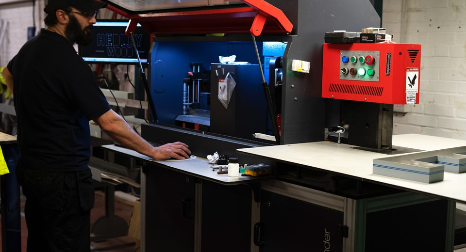
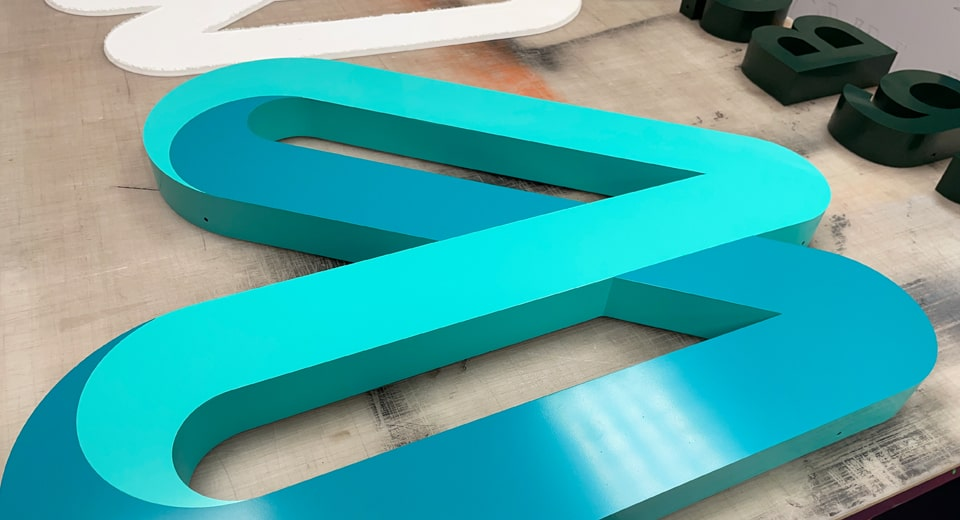
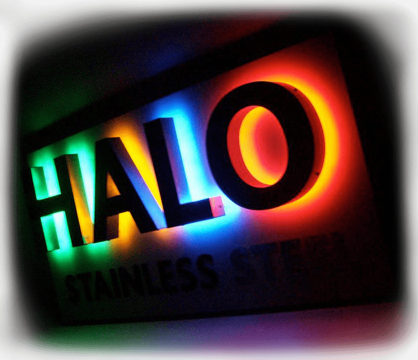

Built Up Letters & Signs
========================

At **Fabricut**, we are proud to offer **built up letters** for **sign manufactures** and other **suppliers** in the **sign trade industry**. We know just how very few companies there are that offer this exclusive service, so that’s where [we can help](/contact)!

Built Up Letters Bring Flat Text To Life
----------------------------------------

**Built up letters** make normal [flat cut letters](/flat-cut-letters-and-signs) come to life. Having the extra three-dimensional return produces visual weight and depth to your signage. This in turn helps make it visually “pop” from the wall once mounted in position.

This construction method keeps the sign lightweight and we can also build in a variety of **illuminated lighting options** (see Sign Lighting), to **improve the visual impact of the sign** for your client even more.

[View our range of sign finishes](/sign-finishes)

* * *

Manufacturing Built Up Letters & Signs
--------------------------------------

At [Fabricut](/), we’ve been **manufacturing signs for over 30 years** and can work with your own in-house designs, or produce the designs on your behalf for that complete outsourced hassle-free approach.

We bespoke manufacture our **built up letters**, **built up signs** and **other signage** using a combination of the latest computerised letter bending machinery, together with specialist hand crafting, to ensure the accuracy and precision of production for a truly high end finish.

Starting with the face and returns (sides) of the letters, these are precision laser cut. The returns are then formed to follow the shape of the letter using our **automated letter bending machinery**. Once prepped, all the parts are soldered or welded together and fixings are added to achieve a sign that is strong, lightweight and ready for installation.

* * *

Sign Materials, Styles & Options
--------------------------------

There are many different [materials](/sign-materials), styles and options available for your **built up letters**. Stainless steel and powder coated aluminium are the two most common choices for construction. Steel can be brushed, mirror polished or powder coated or even aged (rusted) for a vintage industrial look.

All metal constructed signs are perfect for larger formats, where that extra strength is important, especially when it comes to any health and safety requirements.

If you would like your sign to stand out at night, then consider **illuminating your built up signage** with something from our range of lighting solutions, including waterproof LED lighting for halo or face illumination. Supplied with drivers/transformers and fitting templates.

[Learn more about our materials](/sign-materials)

* * *

Delivery & Installation
-----------------------

Once the final design is complete, it will be securely packed as sustainably as possible by our signage production team. Ready for your collection, delivery or for our direct installation.

We have directly installed thousands of **built up signs** and 3D logos on behalf of many **sign companies and design agencies** over the years. We can also supply user-friendly fitting guides to assist your own **sign fitters** if needed.

* * *

Fabricut: Your Preferred Outsourcing Partner
--------------------------------------------

Fabricut **supply and install built up letters** to the highest of standards and at the most competitive of prices. Our aim is to give you complete piece of mind when choosing us as **your preferred outsourcing partner**.

Get in contact with the **Fabricut** team today and see how we can help you find that **ultimate signage solution**.

[Get in touch](/contact)

How Can We Help
---------------

We’ve been making signage for the sign trade for over 30 years. If you are looking for a new sign supplier, then see how Fabricut can help.

[Contact Us](/contact)

* * *

Sample Sign Boards
------------------

Need examples to show your clients? Order your very own **sample boards** to display in your showrooms and consultation rooms today.

[Sample Sign Boards](/sample-signs)