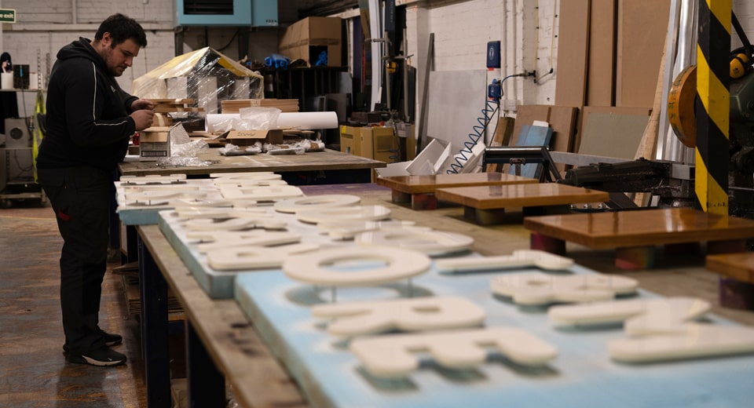
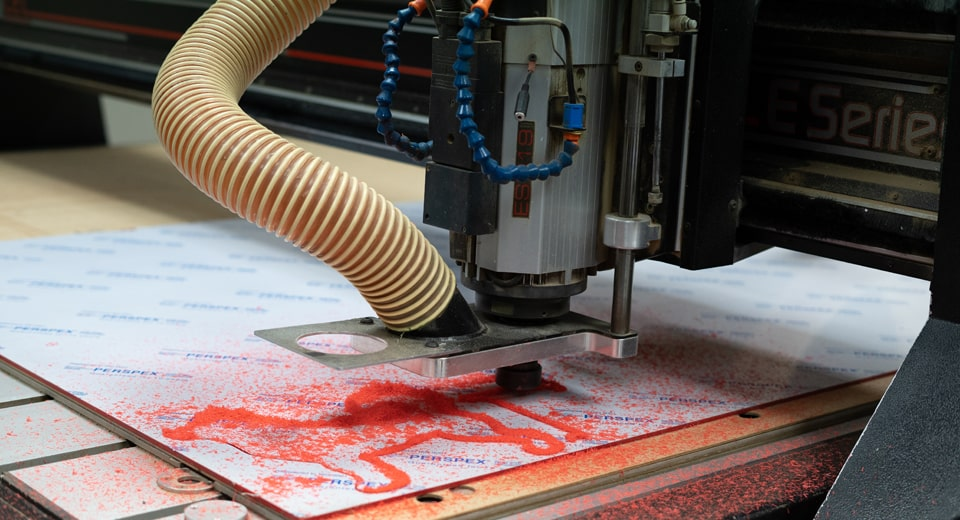

Flat Cut Letters & Signs
========================

At **Fabricut**, we produce **flat cut letters**, **flat cut logos** and **flat cut signs** for the **trade**, including: architects, design agencies and fit-out companies. We can also operate as sub contractors for other sign suppliers too.

With our latest in-house **sign cutting** technology we’re able to produce all your **flat cuts** super fast and with great accuracy. We’re here and [ready to help](/contact)!

* * *

Flat Cut Signs, The Economical First Choice
-------------------------------------------

**Flat cut letters** (or **signs**) are always a popular option, as they’re more economical and quicker to produce than the alternative [built up letters and signs](/built-up-letters-and-signs). They use minimal material and are also extremely lightweight, which makes these signs easy to install too.

When fitted with our “off the wall” locator fixings, this method can give these signs an eye-catching 3D look (when viewed from the front). The sheer variety of finishes available also makes them an attractive choice for many **trade sign makers**.

[View our range of sign finishes](/sign-finishes)

* * *

Manufacturing Flat Cut Logos, Letters & Signs
---------------------------------------------

At [Fabricut](/), we’ve been **manufacturing signs** for **over 30 years** and can work with your own supplied designs or our talented design team can produce the designs on your behalf for that complete **outsourced hassle-free approach**.

We primarily manufacture our **flat cut signs**, **flat cut logos** and **flat cut letters** using an automated computer controlled process. This ensures the accuracy and precision of our **signage production** for a truly high-end finish at a great price.

We can make almost any size **flat cut sign**, **logo**, **letter** or shape up to a maximum of 3 meters high and can provide a variety of fixing methods.

[View our range of sign fixings & extras](/sign-extras-and-spares)

* * *

Sign Materials, Styles & Options
--------------------------------

There are many different [sign materials](/sign-materials), styles and options available for your **flat cut letters, logos and signs**. Acrylic (Perspex), aluminium composite, PVC Foam, aluminium (including powder coating) and stainless steel are the most common choices for construction.

All **metal constructed signs** are perfect for larger formats, where that extra strength is important, especially when it comes to any health and safety requirements. If you have any queries, please talk to one of our **signage specialists**.

[Learn more about our material options](/sign-materials)

* * *

Delivery & Installation
-----------------------

Once your final **flat cut sign** is complete it will be packed securely (and sustainably as possible) by our **signage production team**. It will then be ready for your collection, delivery or for our direct installation on your behalf.

We have directly installed thousands of **flat cut signs** on behalf of many architects, design agencies and **trade sign companies** over the years. We can also supply user-friendly [sign fitting templates](/sign-extras) to assist your own sign fitters if needed.

* * *

Fabricut: Your Preferred Outsourcing Partner
--------------------------------------------

Fabricut **supply and install flat cut letters** to the highest of standards and at the most competitive of prices. At [Fabricut](/), our aim is to give you complete piece of mind when choosing us as **your preferred outsourcing partner**.

Get in contact with the **Fabricut** team today and see how we can help you find that **ultimate signage solution**.

[Get in touch](/contact)

How Can We Help
---------------

We’ve been making signage for the sign trade for over 30 years. If you are looking for a new sign supplier, then see how Fabricut can help.

[Contact Us](/contact)

* * *

Sample Sign Boards
------------------

Need examples to show your clients? Order your very own **sample boards** to display in your showrooms and consultation rooms today.

[Sample Sign Boards](/sample-signs)