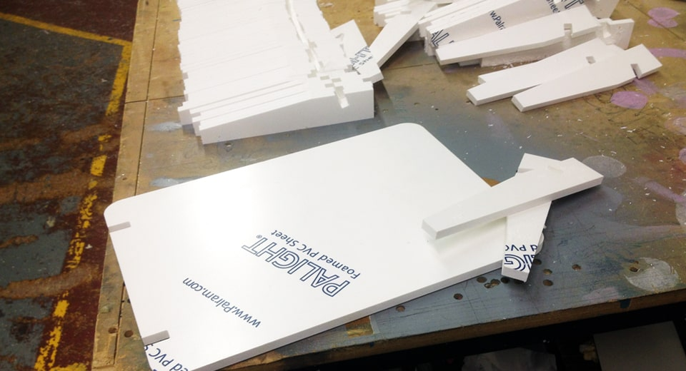

Sign Blanks
===========

At **Fabricut**, we manufacture **sign blanks** (or **sign panels**) for various **trade clients**, including: architectural practices, design agencies and interior fit-out companies. We also operate as **sign blank subcontractors** for other sign suppliers as well.

With our state-of-the-art CNC machinery we’re able to produce any sign blank quickly and with absolute accuracy. We’re here and [ready to help](/contact)!

* * *

Made-to-Measure Sign Blank Panels
---------------------------------

Sign blanks are essentially **blank sign panels**, the structural component of a sign that is supplied ready for a client to apply their own finishes or graphics too before installing.

All our **sign blank panels are made-to-measure**, to your exact requirements and can include all fixing components. In the **sign industry** they’re also commonly referred to as: **sign panels**, **blank signs**, **blank signage panels** and **blank trade signs**.

* * *

Sign Blank / Sign Panel Production
----------------------------------

At [Fabricut](/), we’ve been **producing signs for over 30 years** and can work with your own supplied designs or our talented design team can create the designs on your behalf, for that completely **outsourced hassle-free approach**.

Our sign blanks are precision manufactured using blend of computer control and hand assembly. This ensures the accuracy and quality of our **signage production** for an outstanding high-end finish at trade prices.

Like our [sign trays](/sign-trays), they can be supplied to you as a bare unfinished component, semi-prepared, or as a fully completed sign with all the [extras](/sign-extras-and-spares) ready to install.

[View our range of sign finishes](/sign-finishes)

* * *

Materials for Sign Blanks, Styles & Options
-------------------------------------------

We manufacture our **sign blanks** in our **South West London factory** out of various materials including: metal (stainless steel and aluminium), aluminium composite sheet (ACS), acrylic, PVC foam and MDF.

#### Sign Blank Panel Options

* * *

##### Perspex Cut To Size / Acrylic Cut To Size

Acrylic (or Perspex) panels are a very commonly used to make our sign blanks. We can provide acrylic panels with pre-drilled fixing holes, polished edges, rounded corners, beveled edges and much more.

##### Aluminium Composite Sheet Cut To Size

Aluminium composite sheets (ACS) are a very durable material for both interior and exterior use. They come in a verity of finishes and faux material effects.

##### PVC Foam (Foamex) Cut To Size

Foamex sheets are Ideal for exhibition panels, or short-term exterior and interior signage, it’s a truly versatile sign blank material.

##### MDF Cut To Size

MDF sheets are a very popular sign blank choice to the sign trade. We can cut MDF to size or CNC MDF to any shape.

##### Stainless Steel Cut To Size

Stainless steel is a very durable all-weather material, we can cut a stainless steel sign blank to size for you and provide it in either brushed or polished finish.

##### Aluminium Cut To Size

Aluminium is also another highly durable sign blank material, but lighter than stainless steel. Once painted, it’s ideally suited to both internal and external signage solutions.

A **sign panel** (or **sign blank**) is a vital element in sign manufacturing. At Fabricut, we can powder-coat aluminium sign blank panels to standard [RAL colours](https://en.wikipedia.org/wiki/RAL_colour_standard) and our aluminium composite sign blanks are available in a selection of RAL colours and finishes.

[Learn more about our material options](/sign-materials)

* * *

Delivery & Installation
-----------------------

Once your final sign blank is ready it will be packed securely (and as sustainably as possible) by our signage production team. It will then be available for your collection, delivery or for our direct installation on your behalf.

We have directly installed thousands of sign blanks on behalf of many architectural practices, design agencies and trade sign companies over the years. We can also supply user-friendly sign [sign fitting templates](/sign-extras) to assist your own **sign fitters** if needed.

* * *

Your Preferred Local Outsourcing Partner
----------------------------------------

Fabricut **supply and install sign blank panels** to the highest of standards and at the most competitive trade prices. Our aim is to give you complete piece of mind when choosing us as your preferred outsourcing partner.

Get in contact with the **Fabricut** team today and see how we can help you find that **ultimate signage solution**.

[Get in touch](/contact)

How Can We Help
---------------

We’ve been making signage for the sign trade for over 30 years. If you are looking for a new sign supplier, then see how Fabricut can help.

[Contact Us](/contact)

* * *

Sample Sign Boards
------------------

Need examples to show your clients? Order your very own **sample boards** to display in your showrooms and consultation rooms today.

[Sample Sign Boards](/sample-signs)