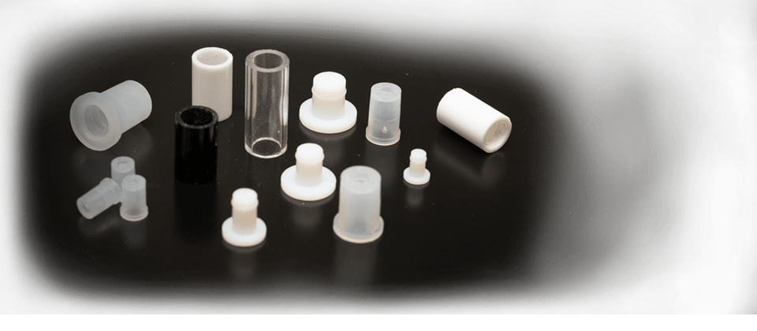
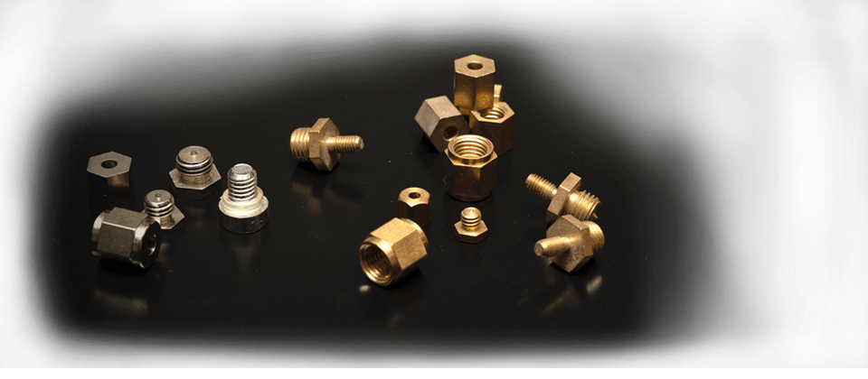
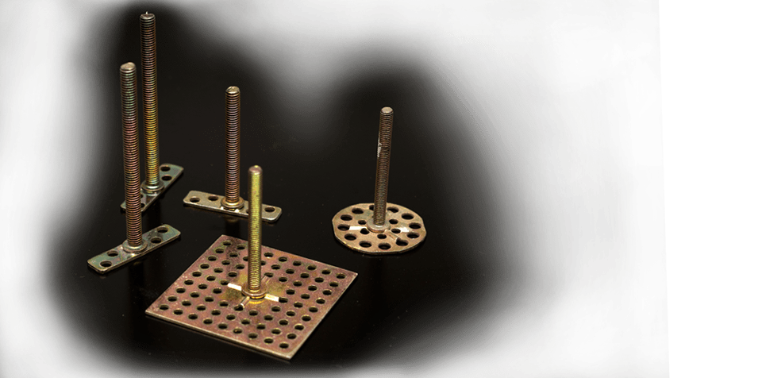
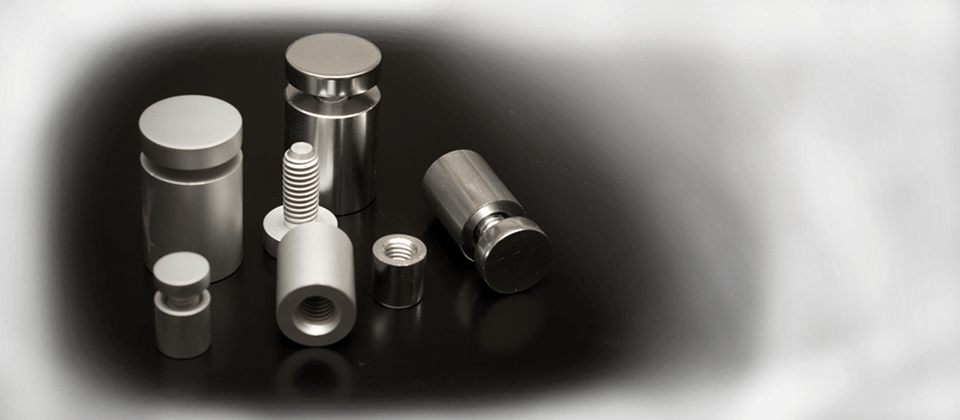
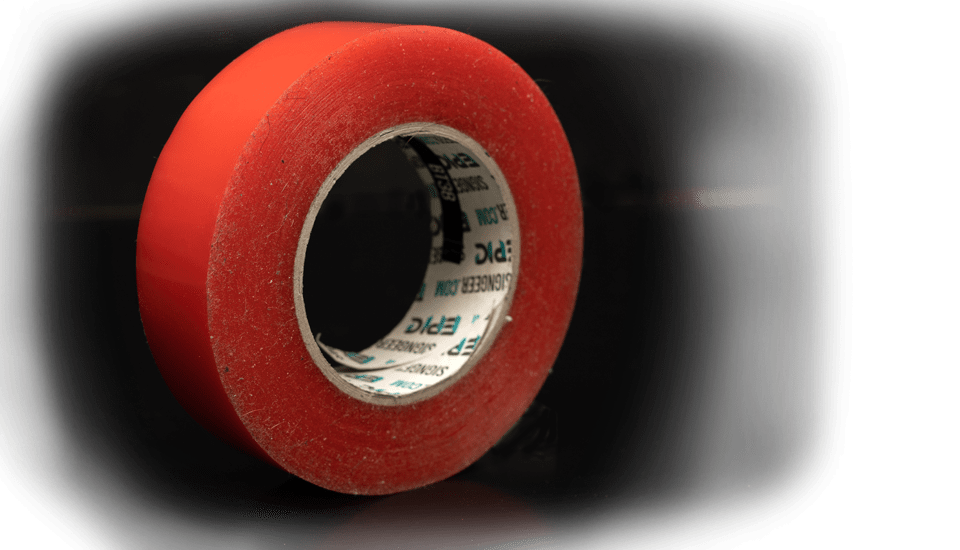

Sign Extras & Fixings
=====================

With **Fabricut**, you gain a **trusted trade sign supplier** and can be assured that we carry a wide range of **sign extras**, **sign fixings**, **sign spares** and add-ons.

All products are ready for installation along with any signage product we’re supplying. We are the **sign trades complete outsourced signage solution**; here and [ready to help](/contact)!

* * *

Acrylic Sign Locators
---------------------

To mount your sign to a wall there are several options available. **Acrylic sign locators** work by having both male and female components. The male component gets bonded to the back of the sign panel (or **sign blank**) and the female part gets located in a drilled out hole.

This allows the [sign panel](/sign-blanks) to be mounted easily and **fitting templates** can be supplied to ensure holes are drilled in the correct locations.

* * *

Brass & Nickel Sign Locators
----------------------------

Another option to mount your sign to the wall (or other surface) is to use **Brass or Nickel sign locators**. These work similar to **acrylic sign locators** in that they usually have two parts (a male and female).

There are several fixing types available: external threaded, internal threaded and fixed woodscrew. They are durable, long lasting and suitable for all weather conditions. **Fitting templates** can be supplied along with a **Fabricut Fitting Guide**.

* * *

Threaded Studs
--------------

Threaded M4 studs (or pins) are welded onto the rear of stainless steel or aluminium signage. The studs can be used for sinking into pilot holes in walls for a flush finish.

Alternatively we can supply acrylic spacers (sleeves) that will space your sign or lettering away from the wall. Supplied with fitting templates.

* * *

Barrel Fixings (Stand Off Fixings)
----------------------------------

Particularly effective with acrylic panels, these are a visible fixing that become part of the signs finished look. Available in satin or chrome finish and in a variety of sizes to suit most sign panels.

For a stylish look, visible metal stand off can be used to mount pre-drilled acrylic or metal sign panels and sign blanks. Usually to display wall logos, maps, posters. Suitable for internal or external walls. Available in a variety of sizes in satin or chrome finishes.

Simply attach the “stand off” stud part to the wall or display unit. Then put the [sign panel](/sign-blanks) (or sign pocket) in place and simply secure by hand with the screw cap. screw in the thumbscrew end – simple. Fitting templates can be supplied along with a Fabricut Fitting Guide.

* * *

Very High Bonding (VHB) Tape
----------------------------

This is a commercial use, double-sided, ultra strong adhesive tape ideal for general sign fixings. When we say “ultra strong”, we mean it! When using **VHB Tape** for the first time it can be daunting; putting your trust in double-sided tape. But once you have used it, you’ll see just how strong it is.

It’s great for the hanging of simple non-removable **sign panels** or bonding things like [flat cut letters](/flat-cut-letters-and-signs) to walls, etc.

* * *

Paper Fixing Templates
----------------------

Positioning a sign can be tricky business, but with a [Fabricut](/) fitting template (or **paper fixing template**) it makes your job easy. Simply request one with your sign order and then when on site, position to your wall or substrate with masking tape and drill your fixing holes as indicated on the template.

* * *

Vinyl Fitting & Paint Stencils
------------------------------

We use high quality low tack **MACmask** from **Mactac** for our stencils, which is less likely to cause damage to paintwork than standard vinyl. These can also be cut and supplied for use as a paint mask for spray painting.

How Can We Help
---------------

We’ve been making signage for the sign trade for over 30 years. If you are looking for a new sign supplier, then see how Fabricut can help.

[Contact Us](/contact)

* * *

Sample Sign Boards
------------------

Need examples to show your clients? Order your very own **sample boards** to display in your showrooms and consultation rooms today.

[Sample Sign Boards](/sample-signs)