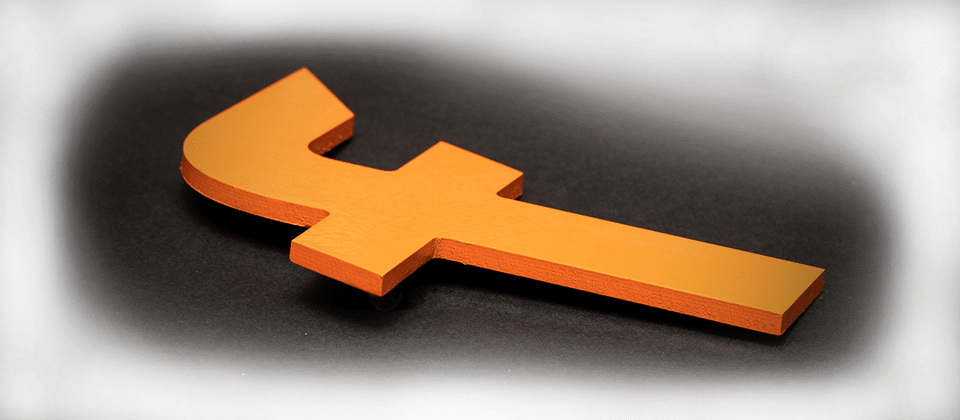
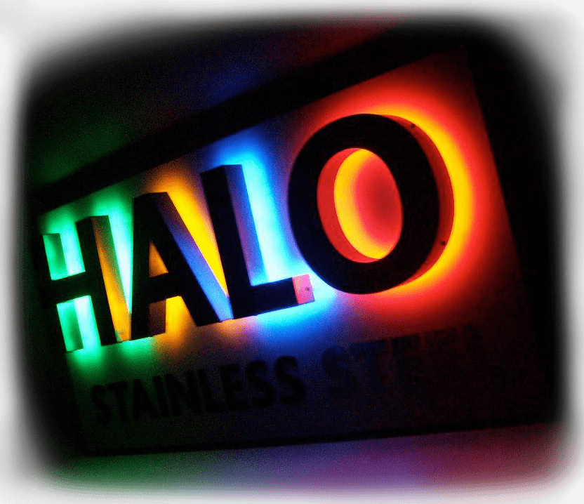

Sign Finishes
=============

At **Fabricut**, we offer a **complete range of finishes** for our **manufactured signs**, providing the ultimate outsourced sign solution for those in the **sign trade industry**.

We can wet spray, powder coat, flame polish, diamond polish, apply vinyl or printed graphics and more. The Fabricut team are here and [ready to help](/contact)!

* * *

Wet Spraying (Painting)
-----------------------

We can **prime** and **wet spray** various materials used in our **sign production** process completely in-house in our **South West London workshop**. Wet spraying is generally used on acrylic signs. However, it can also be used on metal signs when colours cannot be achieved with a powder coating method.

At Fabricut, we use a specialist two pack paint, which is durable and suitable for all materials. There is no need to add additional lacquers as it is extremely hard wearing. Paints are custom mixed to [RAL](https://en.wikipedia.org/wiki/RAL_colour_standard) or [Pantone colours](https://www.pantone.com) as required.

* * *

Powder Coating
--------------

At [Fabricut](/), we can fully prepare and powder coat our manufactured signs to **Classic K7** [RAL colours](https://en.wikipedia.org/wiki/RAL_colour_standard) . Powder coating is a dry finishing process that looks similar to wet spray when finished.

Powder coatings are based on a polymer resin system, made up of various elements. The particles inside are electrically charged and commonly applied to metal signs using a spray gun. All powder-coated parts are then placed in an oven for curing.

The process creates a high-quality finish that is more durable than liquid paints. Powder coating is more resistant to moisture, chemicals, ultraviolet light and extreme weather conditions. It also has some environmental advantages over other processes too.

* * *

Flame Polishing
---------------

**Flame polishing** is a specialist, hand finished process carried out in-house by the **Fabricut** team on the edges of clear acrylic panels and shapes.

Using a flame torch, the process heats up the edge of the material, slightly melting it. This leaves it clear and polished, with a transparency like its faces.

Flame polishing removes all signs of raw cutting tool marks and creates a prestigious “glass like feel” to the final product, with soft (or smoother) edges.

* * *

Diamond Polishing
-----------------

Similar to flame polishing, **diamond polishing** removes cutting marks along the straight raw edges of acrylic panels. However, the edges are left somewhat sharper than flame polishing.

All diamond polishing works are completed in-house by talented Fabricut signage production team. We have machined the edges of thousands of acrylic panels over the years using our own specialist diamond polisher.

If you’re unsure about what type of polishing you may need, [get in touch with our experts](/contact).

* * *

Vinyl Graphics
--------------

The staple for most signs produced by Fabricut on behalf of our trade clients is vinyl graphics and printed graphics.

Vinyl Graphics is the application of an adhesive backed coloured plastic material (sticky-backed-plastic), which can be computer cut in to any shape: letters, numbers, patterns and logos, etc. Each element is applied to the sign in single or multiple layers depending on the design.

* * *

Printed Graphics
----------------

Similar to vinyl graphics, Printed Graphics is the application of an adhesive backed material, however the design is digitally printed directly on to the vinyl on our HP Latex printer ready for a single application.

Moreover, both types of graphics are completed in-house in our **West London** workshop by our skilled sign production team. Alternatively, you can opt for a [Sign Blank](/sign-blanks) and apply the finishing and graphical yourself.

* * *

Fixing Holes & Fixings
----------------------

Whatever type of **sign** or **display product** you are ordering from us we have a range of [sign fixing options](/sign-extras-and-spares) available. From welded metal studs and locators to CNC pilot holes for threaded studs.

All fixings can be supplied or just pre-configured (pilot-holed) for use with your own fixing products. Get in contact with the **Fabricut** team today and see how we can help you find that **ultimate signage solution**.

[Get in touch](/contact)

How Can We Help
---------------

We’ve been making signage for the sign trade for over 30 years. If you are looking for a new sign supplier, then see how Fabricut can help.

[Contact Us](/contact)

* * *

Sample Sign Boards
------------------

Need examples to show your clients? Order your very own **sample boards** to display in your showrooms and consultation rooms today.

[Sample Sign Boards](/sample-signs)