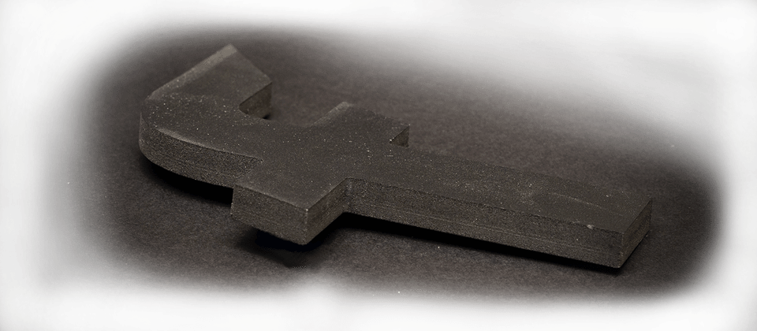
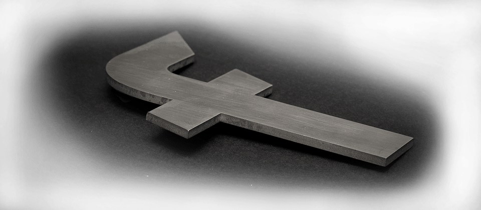

Sign Materials 
===================

If your company is looking to outsource the production of its signs, then you have come to the right place. At **Fabricut**, we stock and use a wide variety of specialist **signage materials** to produce **signs** specifically for **trade customers**.

Below is a list of the **materials available** for your signs production and we also highly recommend viewing our [sign finishes](/sign-finishes) section, which shows all the latest sign finishing techniques that can be outsourced to us.

* * *

Acrylic
-------

Acrylic is perfect for signage use, retail point of sale and general **sign fabrication**. At [Fabricut](/), we usually use the well-known **Perspex®** brand for our acrylic sheets as they are the leaders in acrylic produced and distributed within the UK. This makes it more [environmentally friendly](/sustainability) than importing from abroad.

Acrylic comes in a range of colours and finishes and it cuts beautifully on our **CNC machinery**. Clear acrylic can be finished with [diamond polished edges](/sign-finishes) or [flame polished edges](/sign-finishes). We can also offer a bespoke painting service for instances where specific corporate colours are required.

##### Typical Acrylic Sign Applications

*   Logos & Lettering for [Fascia Trays](/sign-trays)
*   Feature Walls
*   Reception Signs
*   Wayfinding
*   Plaques

* * *

Aluminium Composite Sheet (ACS)
-------------------------------

At **Fabricut**, we typically use the **AluPanel®** brand of **aluminium composite sheet** (ACS), which is the only ACS manufactured in the UK; producing less environmental impact than importing.

**Aluminium composite** is a wonderfully durable and lightweight material, best known for its limited rate of expansion and contraction. Making it highly suitable for both **indoor and outdoor signs**. It is made up of two rigid aluminium sheets with a polyethylene core, securely bonded together during production.

It is particularly suited to high-wear environments, but has a huge range of other applications. **Aluminium composite sheet** is available in a range of standard [RAL colours](https://en.wikipedia.org/wiki/RAL_colour_standard) as well as various brushed metal finishes. It is now widely adopted as the ideal material for the signage and display industry in the place of sheet metals.

##### Typical Aluminium Composite Applications

*   Shop Fascia’s
*   [Sign Trays](/sign-trays)
*   [Flat cut lettering & Logos](/flat-cut-letters-and-signs)
*   Wayfinding Signs
*   Monoliths
*   Hoarding panels

* * *

PVC Foam
--------

**PVC foam** is always popular for low cost signage, point of sale and exhibitions. **PVC foam** comes in flat, lightweight sheets available in a range of colours and sizes. Easily and accurately cut to shape on our computer controlled machinery, it’s also the perfect carrier for vinyl or digital prints.

One **advantage of PVC foam** is that it has an exceptional fire resistance and is self-extinguishing.

##### Typical PVC Foam Applications

*   [Flat cut letters, Signs and Logos](/flat-cut-letters-and-signs)
*   Hoarding Panels
*   Exhibition Panels
*   [Sign Blanks](/sign-blanks)

* * *

Aluminium
---------

Aluminium offers the perfect solution to so many sign applications. It’s a robust, lightweight metal that will last for many years inside or out. **Aluminium** is accurately cut to shape on our **state-of-the-art CNC machinery** and can be welded by our highly skilled in-house **sign manufacturing team**.

It’s typically wet sprayed with a Pantone matched colour or custom mixed colour when needed. Signs produced in aluminium can be supplied with welded brass locators or threaded studs, together with any fitting templates, ready for you to install.

Aluminium is commonly recycled, making it a great choice for **reducing environmental impact** long-term.

##### Typical Aluminium Applications

*   Shop Fascia’s
*   [Fascia Trays](/sign-trays)
*   Monoliths
*   [Sign Panels](/sign-blanks)
*   [Flat Cut Lettering & Logos](/flat-cut-letters-and-signs)
*   [Built Up Letters, Signs & Logos](/built-up-letters-and-signs)

* * *

Stainless Steel
---------------

Stainless steel has many wonderful uses in the signage industry and is typically chosen for when metal work needs to remain untarnished in an all-weather environment. We do recommend **marine graded stainless steel** for coastal areas. However, stainless steel can also be used indoors.

At Fabricut, we precision laser cut stainless steel to shape using our state-of-the-art machinery and can be welded by our professional in-house production and manufacturing team.

Items produced in **stainless steel** have a very prestigious look and can be supplied in a **brushed stainless finish** or a “mirror” **polished stainless finish**. Welded nickel locators or threaded studs can be added for fixings, together with any **sign fitting templates** ready for you to install.

##### Typical Stainless Steel Applications

*   Shop Fascia’s
*   [Fascia Trays](/sign-trays)
*   Monoliths
*   [Sign Panels](/sign-blanks)
*   [Flat Cut Lettering & Logos](/flat-cut-letters-and-signs)
*   [Built Up Letters, Signs & Logos](/built-up-letters-and-signs)

* * *

MDF – Medium Density Fibre Board
--------------------------------

Unfortunately, **MDF is not the most environmentally friendly material** due to the glues used within it. However, the wood particles are sustainably sourced (FSC accredited). MDF is one of the most versatile materials used for interior signs.

At **Fabricut**, we can precisely **cut MDF to size and any shape** with our CNC cutter. It can also be layered for additional thickness by our in-house production team. MDF can be supplied bare or painted to your requirements.

##### Typical MDF Applications

*   Exhibition Panels
*   Feature Walls
*   [Flat Cut Lettering & Logos](/flat-cut-letters-and-signs)

How Can We Help
---------------

We’ve been making signage for the sign trade for over 30 years. If you are looking for a new sign supplier, then see how Fabricut can help.

[Contact Us](/contact)

* * *

Sample Sign Boards
------------------

Need examples to show your clients? Order your very own **sample boards** to display in your showrooms and consultation rooms today.

[Sample Sign Boards](/sample-signs)