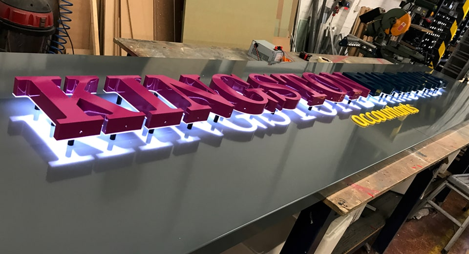

Sign Trays
==========

At **Fabricut**, we manufacture **sign trays** used for retail fascia signage for **trade clients**, including: architectural practices, design agencies and refurbishment companies. We can also act as **sign tray subcontractors for sign companies** too.

With our **state-of-the-art CNC machinery** we’re able to produce any **sign** quickly and with total accuracy. Our team are here and [ready to help](/contact)!

* * *

Made-to-Measure Sign Tray Panels
--------------------------------

All our **sign tray panels** are **made-to-measure**, to your exact requirements and they form the foundation of most signage projects. In the sign industry they’re also commonly referred to as: back trays, fascia panels, fascia trays and sometimes even as “biscuit tin lids”, due to their construction.

A **sign tray** panel is an essential component in sign manufacturing, which can be built-upon with the addition of [built-up letters](/built-up-letters-and-signs), [flat cut letters](/flat-cut-letters-and-signs) or **illuminated push through letters**, vinyl lettering, shapes and logos. Creating a prominent and memorable solution for your customers and their brands.

* * *

Sign Tray Manufacturing
-----------------------

At [Fabricut](/), we’ve been **manufacturing signs** for **over 30 years** and can work with your own supplied designs or our talented design team can create the designs on your behalf, for that completely outsourced hassle-free approach.

Our **sign trays** are made using blend of computer control and hand crafted approach. This ensures the accuracy and precision of our signage production for a superb high-end finish at a great price.

They can be supplied to you as a bare unfinished component, semi-prepared, or as a fully completed fascia sign with all the bells and whistles ready to install.

* * *

Materials for Sign Trays, Styles & Options
------------------------------------------

We manufacture our sign tray panels in our West London factory out of aluminium composite or aluminium.

Aluminium trays can be powder-coated using [RAL colours](https://en.wikipedia.org/wiki/RAL_colour_standard) and **ACS trays** come in various **RAL colours**. Plain, fret cut or illuminated, we can manufacture it for you. If you have any queries, please chat to one of our **signage specialists**.

[Learn more about our material options](/sign-materials)

* * *

Delivery & Installation
-----------------------

Because of their size and fragility, **tray signs** are made ex-works, wrapped ready for your collection, or you can talk to us about installation on your behalf.

We have directly installed thousands of **sign trays** on behalf of many architectural practices, design agencies and **trade sign companies** over the years. We can also supply user-friendly [sign fitting templates](/sign-extras) to assist your own **sign fitters** if needed.

* * *

Fabricut: Your Preferred Outsourcing Partner
--------------------------------------------

Fabricut **supply and install sign tray panels** to the highest of standards and at the most competitive of prices. At [Fabricut](/), our aim is to give you complete piece of mind when choosing us as **your preferred outsourcing partner**.

Get in contact with the **Fabricut** team today and see how we can help you find that **ultimate signage solution**.

[Get in touch](/contact)

How Can We Help
---------------

We’ve been making signage for the sign trade for over 30 years. If you are looking for a new sign supplier, then see how Fabricut can help.

[Contact Us](/contact)

* * *

Sample Sign Boards
------------------

Need examples to show your clients? Order your very own **sample boards** to display in your showrooms and consultation rooms today.

[Sample Sign Boards](/sample-signs)